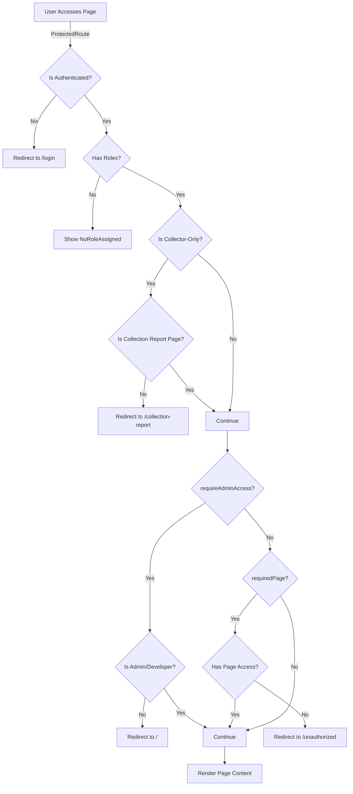

# Authentication and Authorization Guide

**Author:** Aaron Hazzard - Senior Software Engineer  
**Last Updated:** January 2025  
**Version:** 1.0.0

## Table of Contents

1. [Overview](#overview)
2. [Role-Based Access Control (RBAC)](#role-based-access-control-rbac)
3. [Setting Up Page-Level Access Control](#setting-up-page-level-access-control)
4. [Component-Level Access Control](#component-level-access-control)
5. [Permission Utilities](#permission-utilities)
6. [Adding New Page Permissions](#adding-new-page-permissions)
7. [Common Patterns](#common-patterns)
8. [Examples](#examples)

---

## Overview

The Evolution One CMS uses a **Role-Based Access Control (RBAC)** system where:

- Users can have **multiple roles**
- Access is determined by checking if user has **any** of the required roles
- Permissions are checked at **page level** (via `ProtectedRoute`) and **component level** (via utility functions)
- Both **local** (JWT token) and **database** checks are performed for security

### Authentication Flow

1. User logs in → JWT token created with user roles
2. Token stored in HTTP-only cookie
3. `ProtectedRoute` checks authentication and authorization
4. Page renders if user has required permissions

### Authorization Levels

- **Page-Level**: Entire page access (via `ProtectedRoute`)
- **Component-Level**: Show/hide features within a page (via utility functions)
- **Tab-Level**: Show/hide tabs within a page (via `hasTabAccess`)

---

## Role-Based Access Control (RBAC)

### Available Roles

The system supports the following roles (in priority order):

1. **Developer** - Full platform access with all permissions
2. **Admin** - High-level administrative functions with most system access
3. **Manager** - Operational oversight with management-level permissions
4. **Location Admin** - Location-specific management within assigned locations
5. **Technician** - Technical operations focused on machines and systems
6. **Collector** - Collection operations focused on money collection

### Role Hierarchy

Higher roles inherit permissions from lower roles:

- **Developer/Admin**: Can access everything
- **Manager**: Can access most pages except admin-only features
- **Location Admin**: Can access location-specific pages
- **Technician**: Can access machines and location details
- **Collector**: Can only access collection reports

### Multi-Role Users

Users can have **multiple roles** assigned:

- Access is granted if user has **any** of the required roles
- Example: User with `['technician', 'location admin']` can access both technician and location admin pages
- Example: User with `['collector', 'developer']` gets full platform access (developer overrides collector restrictions)

---

## Setting Up Page-Level Access Control

### Method 1: Using `requiredPage` (Recommended)

**Use when:** You want to restrict a page to specific roles defined in the permissions system.

**How it works:**

- `ProtectedRoute` checks if user has access to the specified page
- Uses `hasPageAccess()` utility to check user roles against page permissions
- Falls back to database check if local check fails

**Example:**

```typescript
export default function YourPage() {
  return (
    <ProtectedRoute requiredPage="reports">
      <YourPageContent />
    </ProtectedRoute>
  );
}
```

**Available Page Names:**

- `"dashboard"` - Dashboard page
- `"machines"` - Machines/Cabinets page
- `"locations"` - Locations page
- `"location-details"` - Location details page
- `"members"` - Members page
- `"member-details"` - Member details page
- `"collection-report"` - Collection report page
- `"reports"` - Reports page
- `"sessions"` - Sessions page
- `"administration"` - Administration page

**Page Permissions (from `lib/utils/permissions.ts`):**

```typescript
const pagePermissions: Record<PageName, string[]> = {
  dashboard: ['developer', 'admin', 'manager', 'location admin'],
  machines: ['developer', 'admin', 'manager', 'location admin', 'technician'],
  locations: ['developer', 'admin', 'manager', 'location admin'],
  'location-details': [
    'developer',
    'admin',
    'manager',
    'location admin',
    'technician',
  ],
  members: ['developer', 'admin'], // Admin-only
  'member-details': ['developer', 'admin'], // Admin-only
  'collection-report': [
    'developer',
    'admin',
    'manager',
    'location admin',
    'collector',
  ],
  reports: ['developer', 'admin', 'manager', 'location admin'],
  sessions: ['developer', 'admin'], // Admin-only
  administration: ['developer', 'admin', 'manager', 'location admin'],
};
```

### Method 2: Using `requireAdminAccess`

**Use when:** You want to restrict a page to **only** admin/developer roles.

**How it works:**

- `ProtectedRoute` checks if user has `admin` or `developer` role
- Simpler than `requiredPage` for admin-only pages

**Example:**

```typescript
export default function AdminOnlyPage() {
  return (
    <ProtectedRoute requireAdminAccess={true}>
      <AdminOnlyPageContent />
    </ProtectedRoute>
  );
}
```

**Note:** This is equivalent to using `requiredPage` with a page that only allows `['developer', 'admin']` roles.

### Method 3: Custom Role Check (Not Recommended)

**Use when:** You need very specific role combinations that don't fit the page permission system.

**How it works:**

- Check roles manually in your page component
- Redirect or show access denied message

**Example:**

```typescript
function YourPageContent() {
  const { user } = useUserStore();
  const router = useRouter();

  useEffect(() => {
    const roles = user?.roles || [];
    const allowedRoles = ['developer', 'admin', 'manager'];
    const hasAccess = allowedRoles.some(role => roles.includes(role));

    if (!hasAccess) {
      router.push('/unauthorized');
    }
  }, [user, router]);

  // ... rest of component
}
```

**⚠️ Warning:** This bypasses the `ProtectedRoute` system and should only be used for very specific cases.

---

## Component-Level Access Control

### Checking Roles in Components

**Use when:** You want to show/hide features, buttons, or sections based on user roles.

**Pattern:**

```typescript
import { useUserStore } from '@/lib/store/userStore';
import { hasAdminAccess, hasManagerAccess } from '@/lib/utils/permissions';

function YourComponent() {
  const { user } = useUserStore();
  const roles = user?.roles || [];

  // Check for specific roles
  const isAdmin = hasAdminAccess(roles);
  const isManager = hasManagerAccess(roles);
  const canManage = ['developer', 'admin', 'manager'].some(r => roles.includes(r));

  return (
    <div>
      {isAdmin && (
        <Button onClick={handleAdminAction}>Admin Action</Button>
      )}

      {canManage && (
        <Button onClick={handleManageAction}>Manage</Button>
      )}
    </div>
  );
}
```

### Using `useMemo` for Performance

**Use when:** Role checks are used multiple times or in render logic.

**Example:**

```typescript
function YourComponent() {
  const { user } = useUserStore();

  const canManage = useMemo(() => {
    const roles = user?.roles || [];
    return ['developer', 'admin', 'manager', 'location admin'].some(
      r => roles.includes(r)
    );
  }, [user]);

  return (
    <div>
      {canManage && (
        <Button onClick={handleCreate}>Create New</Button>
      )}
    </div>
  );
}
```

### Common Role Check Patterns

**Admin/Developer Only:**

```typescript
const isAdmin = useMemo(() => {
  const roles = user?.roles || [];
  return roles.includes('developer') || roles.includes('admin');
}, [user]);
```

**Manager or Higher:**

```typescript
const isManagerOrHigher = useMemo(() => {
  const roles = user?.roles || [];
  return ['developer', 'admin', 'manager'].some(r => roles.includes(r));
}, [user]);
```

**Specific Role:**

```typescript
const isTechnician = useMemo(() => {
  const roles = user?.roles || [];
  return roles.includes('technician');
}, [user]);
```

**Multiple Roles (OR logic):**

```typescript
const canAccess = useMemo(() => {
  const roles = user?.roles || [];
  return ['developer', 'admin', 'manager'].some(r => roles.includes(r));
}, [user]);
```

**Multiple Roles (AND logic):**

```typescript
const hasBothRoles = useMemo(() => {
  const roles = user?.roles || [];
  return roles.includes('technician') && roles.includes('location admin');
}, [user]);
```

---

## Permission Utilities

### Available Utility Functions

**File:** `lib/utils/permissions.ts`

#### `hasPageAccess(userRoles, page)`

Checks if user has access to a specific page.

```typescript
import { hasPageAccess, type PageName } from '@/lib/utils/permissions';

const roles = user?.roles || [];
const canAccessReports = hasPageAccess(roles, 'reports');
```

**Parameters:**

- `userRoles: string[]` - Array of user's roles
- `page: PageName` - Page name to check

**Returns:** `boolean` - `true` if user has access

#### `hasTabAccess(userRoles, page, tab)`

Checks if user has access to a specific tab within a page.

```typescript
import { hasTabAccess } from '@/lib/utils/permissions';

const roles = user?.roles || [];
const canAccessLicenseesTab = hasTabAccess(
  roles,
  'administration',
  'licensees'
);
```

**Parameters:**

- `userRoles: string[]` - Array of user's roles
- `page: string` - Page name
- `tab: string` - Tab name

**Returns:** `boolean` - `true` if user has access

#### `hasAdminAccess(userRoles)`

Checks if user has admin-level access (developer or admin).

```typescript
import { hasAdminAccess } from '@/lib/utils/permissions';

const roles = user?.roles || [];
const isAdmin = hasAdminAccess(roles);
```

**Returns:** `boolean` - `true` if user is developer or admin

#### `hasManagerAccess(userRoles)`

Checks if user has manager-level access or higher.

```typescript
import { hasManagerAccess } from '@/lib/utils/permissions';

const roles = user?.roles || [];
const isManagerOrHigher = hasManagerAccess(roles);
```

**Returns:** `boolean` - `true` if user is developer, admin, or manager

#### `shouldShowNavigationLink(userRoles, page)`

Checks if navigation link should be shown for a page.

```typescript
import { shouldShowNavigationLink } from '@/lib/utils/permissions';

const roles = user?.roles || [];
const showLink = shouldShowNavigationLink(roles, 'reports');
```

**Returns:** `boolean` - `true` if link should be shown

### Database-Based Permission Checks

**File:** `lib/utils/permissionsDb.ts`

For server-side checks (API routes, server components):

#### `hasPageAccessDb(page)`

```typescript
import { hasPageAccessDb } from '@/lib/utils/permissionsDb';

const canAccess = await hasPageAccessDb('reports');
```

#### `hasAdminAccessDb()`

```typescript
import { hasAdminAccessDb } from '@/lib/utils/permissionsDb';

const isAdmin = await hasAdminAccessDb();
```

**Note:** These functions query the database directly and are used when JWT token data might be stale.

---

## Adding New Page Permissions

### Step 1: Add Page Name to Type

**File:** `lib/utils/permissions.ts`

```typescript
export type PageName =
  | 'dashboard'
  | 'machines'
  | 'locations'
  // ... existing pages
  | 'your-new-page'; // Add your new page
```

### Step 2: Add Page Permissions

**File:** `lib/utils/permissions.ts`

In the `hasPageAccess` function, add your page to `pagePermissions`:

```typescript
export const hasPageAccess = (userRoles: string[], page: PageName): boolean => {
  const pagePermissions: Record<PageName, string[]> = {
    // ... existing pages
    'your-new-page': ['developer', 'admin', 'manager'], // Add allowed roles
  };

  const requiredRoles = pagePermissions[page] || [];
  return requiredRoles.some(role => userRoles.includes(role));
};
```

### Step 3: Add Database Permissions (Optional)

**File:** `lib/utils/permissionsDb.ts`

If you need server-side checks, add to `hasPageAccessDb`:

```typescript
export async function hasPageAccessDb(page: PageName): Promise<boolean> {
  // ... existing code ...

  const pagePermissions: Record<PageName, UserRole[]> = {
    // ... existing pages
    'your-new-page': ['developer', 'admin', 'manager'], // Add allowed roles
  };

  // ... rest of function
}
```

### Step 4: Use in ProtectedRoute

**File:** `app/your-new-page/page.tsx`

```typescript
export default function YourNewPage() {
  return (
    <ProtectedRoute requiredPage="your-new-page">
      <YourNewPageContent />
    </ProtectedRoute>
  );
}
```

---

## Common Patterns

### Pattern 1: Admin-Only Page

```typescript
export default function AdminPage() {
  return (
    <ProtectedRoute requireAdminAccess={true}>
      <AdminPageContent />
    </ProtectedRoute>
  );
}
```

### Pattern 2: Multi-Role Page

```typescript
export default function ReportsPage() {
  return (
    <ProtectedRoute requiredPage="reports">
      <ReportsPageContent />
    </ProtectedRoute>
  );
}
```

**Note:** The `"reports"` page allows: `['developer', 'admin', 'manager', 'location admin']`

### Pattern 3: Conditional Feature Rendering

```typescript
function YourPageContent() {
  const { user } = useUserStore();

  const canManage = useMemo(() => {
    const roles = user?.roles || [];
    return ['developer', 'admin', 'manager'].some(r => roles.includes(r));
  }, [user]);

  return (
    <div>
      {canManage && (
        <Button onClick={handleCreate}>Create New</Button>
      )}
    </div>
  );
}
```

### Pattern 4: Role-Based Tab Access

```typescript
import { hasTabAccess } from '@/lib/utils/permissions';

function YourPageContent() {
  const { user } = useUserStore();
  const roles = user?.roles || [];

  const tabs = [
    { id: 'general', label: 'General' },
    { id: 'admin', label: 'Admin', requiresAdmin: true },
  ];

  const visibleTabs = tabs.filter(tab => {
    if (tab.requiresAdmin) {
      return hasAdminAccess(roles);
    }
    return true;
  });

  return (
    <Tabs>
      {visibleTabs.map(tab => (
        <Tab key={tab.id} value={tab.id}>
          {tab.label}
        </Tab>
      ))}
    </Tabs>
  );
}
```

### Pattern 5: API Route Protection

**File:** `app/api/your-endpoint/route.ts`

```typescript
import { getUserFromServer } from '@/app/api/lib/helpers/users';
import { hasPageAccessDb } from '@/lib/utils/permissionsDb';

export async function GET(request: NextRequest) {
  const user = await getUserFromServer();

  if (!user) {
    return NextResponse.json({ error: 'Unauthorized' }, { status: 401 });
  }

  const roles = (user.roles as string[]) || [];
  const canAccess = await hasPageAccessDb('your-page');

  if (!canAccess) {
    return NextResponse.json({ error: 'Forbidden' }, { status: 403 });
  }

  // ... rest of handler
}
```

---

## Examples

### Example 1: Creating an Admin-Only Page

**File:** `app/analytics/page.tsx`

```typescript
'use client';

import ProtectedRoute from '@/components/auth/ProtectedRoute';
import PageErrorBoundary from '@/components/ui/errors/PageErrorBoundary';
import PageLayout from '@/components/layout/PageLayout';

function AnalyticsPageContent() {
  // Your page content
  return (
    <PageLayout pageTitle="Analytics">
      <div>Analytics content</div>
    </PageLayout>
  );
}

export default function AnalyticsPage() {
  return (
    <ProtectedRoute requireAdminAccess={true}>
      <PageErrorBoundary>
        <AnalyticsPageContent />
      </PageErrorBoundary>
    </ProtectedRoute>
  );
}
```

### Example 2: Creating a Multi-Role Page

**File:** `app/reports/analytics/page.tsx`

```typescript
'use client';

import ProtectedRoute from '@/components/auth/ProtectedRoute';
import PageErrorBoundary from '@/components/ui/errors/PageErrorBoundary';
import PageLayout from '@/components/layout/PageLayout';

function AnalyticsReportsPageContent() {
  // Your page content
  return (
    <PageLayout pageTitle="Analytics Reports">
      <div>Analytics reports content</div>
    </PageLayout>
  );
}

export default function AnalyticsReportsPage() {
  // First, add 'analytics-reports' to PageName type and permissions
  return (
    <ProtectedRoute requiredPage="reports"> {/* Use existing 'reports' permission */}
      <PageErrorBoundary>
        <AnalyticsReportsPageContent />
      </PageErrorBoundary>
    </ProtectedRoute>
  );
}
```

### Example 3: Component with Role-Based Features

**File:** `components/YourComponent.tsx`

```typescript
'use client';

import { useUserStore } from '@/lib/store/userStore';
import { hasAdminAccess, hasManagerAccess } from '@/lib/utils/permissions';
import { Button } from '@/components/ui/button';
import { useMemo } from 'react';

export default function YourComponent() {
  const { user } = useUserStore();

  const roles = user?.roles || [];
  const isAdmin = hasAdminAccess(roles);
  const isManagerOrHigher = hasManagerAccess(roles);
  const canManage = useMemo(() => {
    return ['developer', 'admin', 'manager', 'location admin'].some(
      r => roles.includes(r)
    );
  }, [roles]);

  return (
    <div>
      <h1>Your Component</h1>

      {/* Admin-only feature */}
      {isAdmin && (
        <Button onClick={handleAdminAction}>Admin Action</Button>
      )}

      {/* Manager or higher feature */}
      {isManagerOrHigher && (
        <Button onClick={handleManagerAction}>Manager Action</Button>
      )}

      {/* Multiple roles feature */}
      {canManage && (
        <Button onClick={handleManageAction}>Manage</Button>
      )}

      {/* Always visible */}
      <Button onClick={handleViewAction}>View</Button>
    </div>
  );
}
```

### Example 4: Conditional Tab Rendering

**File:** `components/YourTabs.tsx`

```typescript
'use client';

import { useUserStore } from '@/lib/store/userStore';
import { hasAdminAccess, hasTabAccess } from '@/lib/utils/permissions';
import { Tabs, TabsList, TabsTrigger, TabsContent } from '@/components/ui/tabs';

export default function YourTabs() {
  const { user } = useUserStore();
  const roles = user?.roles || [];

  const tabs = [
    { id: 'general', label: 'General', roles: ['developer', 'admin', 'manager'] },
    { id: 'advanced', label: 'Advanced', roles: ['developer', 'admin'] },
    { id: 'settings', label: 'Settings', roles: ['developer', 'admin', 'manager', 'location admin'] },
  ];

  const visibleTabs = tabs.filter(tab => {
    return tab.roles.some(role => roles.includes(role));
  });

  return (
    <Tabs defaultValue={visibleTabs[0]?.id}>
      <TabsList>
        {visibleTabs.map(tab => (
          <TabsTrigger key={tab.id} value={tab.id}>
            {tab.label}
          </TabsTrigger>
        ))}
      </TabsList>

      {visibleTabs.map(tab => (
        <TabsContent key={tab.id} value={tab.id}>
          {/* Tab content */}
        </TabsContent>
      ))}
    </Tabs>
  );
}
```

### Example 5: API Route with Role Check

**File:** `app/api/admin/analytics/route.ts`

```typescript
import { getUserFromServer } from '@/app/api/lib/helpers/users';
import { hasAdminAccessDb } from '@/lib/utils/permissionsDb';
import { NextRequest, NextResponse } from 'next/server';

export async function GET(request: NextRequest) {
  try {
    // Get user from JWT token
    const user = await getUserFromServer();

    if (!user) {
      return NextResponse.json({ error: 'Unauthorized' }, { status: 401 });
    }

    // Check admin access (database check for security)
    const isAdmin = await hasAdminAccessDb();

    if (!isAdmin) {
      return NextResponse.json(
        { error: 'Forbidden: Admin access required' },
        { status: 403 }
      );
    }

    // Fetch analytics data
    const analyticsData = await fetchAnalyticsData();

    return NextResponse.json({ data: analyticsData });
  } catch (error) {
    return NextResponse.json(
      { error: 'Internal server error' },
      { status: 500 }
    );
  }
}
```

---

## How ProtectedRoute Works

### Authentication Check Flow



### Permission Check Order

1. **Authentication Check**: Is user logged in?
2. **Roles Check**: Does user have roles?
3. **Collector-Only Check**: Is user collector-only? (special case)
4. **Admin Access Check**: If `requireAdminAccess={true}`, check for admin/developer
5. **Page Access Check**: If `requiredPage` specified, check page permissions
6. **Database Fallback**: If local check fails, verify with database

### Local vs Database Checks

**Local Check (Fast):**

- Uses JWT token roles
- Checks `hasPageAccess(user.roles, page)`
- Instant response

**Database Check (Fallback):**

- Queries database for current user roles
- Used when local check fails or for security-critical operations
- Slower but more reliable

---

## Best Practices

### 1. Always Use ProtectedRoute for Authenticated Pages

```typescript
// ✅ GOOD
export default function YourPage() {
  return (
    <ProtectedRoute requiredPage="your-page">
      <YourPageContent />
    </ProtectedRoute>
  );
}

// ❌ BAD - No protection
export default function YourPage() {
  return <YourPageContent />;
}
```

### 2. Use Page Permissions When Possible

```typescript
// ✅ GOOD - Uses permission system
<ProtectedRoute requiredPage="reports">
  <ReportsContent />
</ProtectedRoute>

// ❌ BAD - Manual role check in component
function ReportsContent() {
  const { user } = useUserStore();
  if (!user?.roles.includes('developer')) {
    return <div>Access Denied</div>;
  }
  // ...
}
```

### 3. Use Utility Functions for Role Checks

```typescript
// ✅ GOOD - Uses utility function
import { hasAdminAccess } from '@/lib/utils/permissions';
const isAdmin = hasAdminAccess(roles);

// ❌ BAD - Manual role check
const isAdmin = roles.includes('developer') || roles.includes('admin');
```

### 4. Memoize Role Checks in Components

```typescript
// ✅ GOOD - Memoized
const canManage = useMemo(() => {
  const roles = user?.roles || [];
  return ['developer', 'admin', 'manager'].some(r => roles.includes(r));
}, [user]);

// ❌ BAD - Recalculated on every render
const canManage = ['developer', 'admin', 'manager'].some(r =>
  user?.roles?.includes(r)
);
```

### 5. Check Roles in API Routes

```typescript
// ✅ GOOD - API route protection
export async function GET(request: NextRequest) {
  const user = await getUserFromServer();
  if (!user) {
    return NextResponse.json({ error: 'Unauthorized' }, { status: 401 });
  }

  const canAccess = await hasPageAccessDb('your-page');
  if (!canAccess) {
    return NextResponse.json({ error: 'Forbidden' }, { status: 403 });
  }

  // ... handler
}
```

---

## Troubleshooting

### Issue: User Can't Access Page Despite Having Role

**Check:**

1. Is the page name correct in `PageName` type?
2. Is the role included in `pagePermissions` for that page?
3. Are roles loaded in JWT token? (Check `user.roles` in dev tools)
4. Is database check failing? (Check server logs)

### Issue: Page Shows "Unauthorized" for Valid Users

**Check:**

1. Verify role names match exactly (case-sensitive)
2. Check if user has multiple roles (should work if any role matches)
3. Verify `hasPageAccessDb` returns correct value (check database)

### Issue: Component Features Not Showing/Hiding Correctly

**Check:**

1. Is `user` loaded from `useUserStore`?
2. Are roles checked correctly? (Use utility functions)
3. Is `useMemo` used for performance? (May cause stale checks)

---

## Additional Resources

### Related Documentation

- `Documentation/PAGE_SETUP_GUIDE.md` - How to set up pages with wrappers
- `Documentation/Role Based Permissions.md` - High-level RBAC overview
- `Documentation/backend/core-apis/auth-api.md` - Authentication API details

### Key Files Reference

**Frontend:**

- `components/auth/ProtectedRoute.tsx` - Page protection component
- `lib/utils/permissions.ts` - Permission utility functions
- `lib/hooks/useAuth.ts` - Authentication hook
- `lib/store/userStore.ts` - User state store

**Backend:**

- `lib/utils/permissionsDb.ts` - Database permission checks
- `app/api/lib/helpers/users.ts` - User helper functions
- `app/api/lib/helpers/auth.ts` - Authentication helpers

### Permission System Files

- `lib/utils/permissions.ts` - **Main permission utilities** (client-side)
- `lib/utils/permissionsDb.ts` - **Database permission checks** (server-side)
- `components/auth/ProtectedRoute.tsx` - **Page protection wrapper**

---

## Quick Reference

### Page Protection

```typescript
// Admin-only page
<ProtectedRoute requireAdminAccess={true}>
  <PageContent />
</ProtectedRoute>

// Multi-role page
<ProtectedRoute requiredPage="reports">
  <PageContent />
</ProtectedRoute>
```

### Component Role Checks

```typescript
import { hasAdminAccess, hasManagerAccess } from '@/lib/utils/permissions';

const roles = user?.roles || [];
const isAdmin = hasAdminAccess(roles);
const isManager = hasManagerAccess(roles);
```

### API Route Protection

```typescript
const user = await getUserFromServer();
const canAccess = await hasPageAccessDb('your-page');
```
