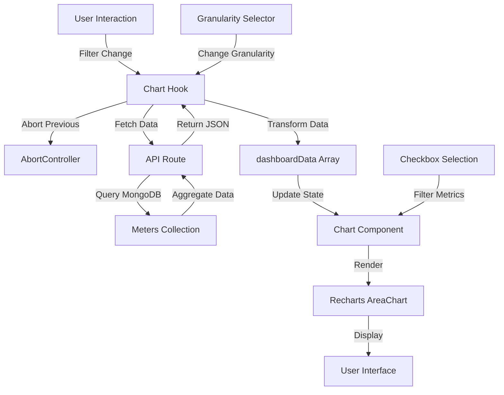

# Charts Architecture Guide

**Author:** Aaron Hazzard - Senior Software Engineer  
**Last Updated:** January 2025  
**Version:** 1.0.0

## Table of Contents

1. [Introduction to Charts in Next.js](#introduction-to-charts-in-nextjs)
2. [Chart System Overview](#chart-system-overview)
3. [Core Chart Components](#core-chart-components)
4. [Data Structures](#data-structures)
5. [Chart Rendering Pipeline](#chart-rendering-pipeline)
6. [Granularity System](#granularity-system)
7. [Metric Filtering (Checkboxes)](#metric-filtering-checkboxes)

---

## Introduction to Charts in Next.js

### Client-Side Rendering

Charts in this Next.js application are rendered entirely on the client side using React and Recharts. This approach provides:

- **Interactive Features**: Hover tooltips, zooming, panning
- **Real-time Updates**: Data can be updated without full page reloads
- **Performance**: Client-side rendering avoids server-side computation for visualizations
- **Responsive Design**: Charts adapt to different screen sizes automatically

### Data Fetching Patterns

Charts use Next.js API routes to fetch data:

1. **API Routes** (`app/api/`): Server-side endpoints that query MongoDB
2. **Client Hooks**: React hooks (`useLocationChartData`, `useCabinetPageData`, etc.) manage data fetching
3. **State Management**: Zustand store and React state manage chart data
4. **Abort Controllers**: Cancel previous requests when filters change

### State Management Approaches

- **Zustand Store**: Global state for dashboard charts (`dashboardStore.ts`)
- **React Hooks**: Local state for page-specific charts (`useLocationChartData`, etc.)
- **Request Deduplication**: Prevents duplicate API calls for same parameters
- **Loading States**: Separate loading states for chart data vs. other data

---

## Chart System Overview

### Component Hierarchy

```
Page Component (app/page.tsx, app/locations/[slug]/page.tsx, etc.)
  └── Chart Hook (useLocationChartData, useCabinetPageData, etc.)
      ├── API Call (getMachineChartData, getMetrics, etc.)
      └── Data Transformation
  └── Chart Component (components/ui/dashboard/Chart.tsx)
      ├── Recharts AreaChart
      ├── Metric Checkboxes (Money In, Money Out, Gross)
      ├── Granularity Selector (if applicable)
      └── Tooltip & Formatting
```

### Data Flow Diagram



### Key Libraries

- **Recharts**: React charting library built on D3.js
  - `AreaChart`, `Area`, `XAxis`, `YAxis`, `Tooltip`, `CartesianGrid`
  - Responsive container for mobile/desktop adaptation
- **React Hooks**: `useState`, `useEffect`, `useMemo`, `useCallback` for state management
- **Axios**: HTTP client for API requests
- **Zustand**: Global state management for dashboard

---

## Core Chart Components

### Main Chart Component

**File:** `components/ui/dashboard/Chart.tsx`

**Purpose:** Universal chart component used across dashboard, location details, and cabinet details pages.

**Features:**

- Recharts `AreaChart` with three metrics (Money In, Money Out, Gross)
- Checkbox filtering for individual metrics
- Granularity-aware formatting (hourly, minute, daily, weekly, monthly)
- Loading skeleton states
- Empty state handling
- Data trimming (removes leading/trailing zeros)

**Props:**

```typescript
type ChartProps = {
  loadingChartData: boolean;
  chartData: dashboardData[];
  activeMetricsFilter: TimePeriod | '';
  totals?: DashboardTotals | null;
  granularity?: 'hourly' | 'minute' | 'daily' | 'weekly' | 'monthly';
};
```

**Key Functionality:**

- Renders skeleton loader when `loadingChartData` is true
- Filters chart data based on selected metrics (checkboxes)
- Formats X-axis labels based on granularity
- Trims leading/trailing zero-value data points
- Handles gap detection between data points

### Location Trend Chart Component

**File:** `components/ui/LocationTrendChart.tsx`

**Purpose:** Specialized chart for location trends on reports page.

**Features:**

- Line chart (not area chart) for multiple locations
- Supports multiple location IDs with different colors
- Configurable data keys (handle, winLoss, jackpot, plays, drop, gross)
- Hourly or daily time series
- Monthly/weekly formatting support

**Props:**

```typescript
type LocationTrendChartProps = {
  title: string;
  icon: React.ReactNode;
  data: Array<{
    day: string;
    time?: string;
    [locationId: string]:
      | {
          handle: number;
          winLoss: number;
          jackpot: number;
          plays: number;
          drop: number;
          gross: number;
        }
      | string
      | undefined;
  }>;
  dataKey: 'handle' | 'winLoss' | 'jackpot' | 'plays' | 'drop' | 'gross';
  locations: string[];
  locationNames?: Record<string, string>;
  colors: string[];
  formatter: (value: number) => string;
  isHourly?: boolean;
  timePeriod?: TimePeriod;
  granularity?: ChartGranularity;
};
```

---

## Data Structures

### dashboardData Type

**File:** `lib/types/index.ts`

**Definition:**

```typescript
export type dashboardData = {
  xValue: string; // Combined day/time for sorting
  day: string; // Date string (YYYY-MM-DD or YYYY-MM for monthly)
  time: string; // Time string (HH:MM or HH:00)
  moneyIn: number; // Drop amount (money in)
  moneyOut: number; // Total cancelled credits (money out)
  gross: number; // Gross revenue (moneyIn - moneyOut)
  location?: string; // Optional location identifier
  machine?: string; // Optional machine identifier
  geoCoords?: {
    // Optional geographic coordinates
    latitude?: number;
    longitude?: number;
    longtitude?: number; // Typo variant for backwards compatibility
  };
};
```

### API Response Formats

#### Dashboard Chart API Response

**Endpoint:** `/api/analytics/charts` (via `getMetrics` helper)

**Response Format:**

```json
{
  "success": true,
  "data": [
    {
      "day": "2025-12-29",
      "time": "00:00",
      "drop": 15000,
      "totalCancelledCredits": 5000,
      "gross": 10000
    },
    {
      "day": "2025-12-29",
      "time": "01:00",
      "drop": 18000,
      "totalCancelledCredits": 6000,
      "gross": 12000
    }
  ]
}
```

**Transformation:**

- `drop` → `moneyIn`
- `totalCancelledCredits` → `moneyOut`
- `gross` → `gross`
- `day` + `time` → `xValue` (for sorting)

#### Machine Chart API Response

**Endpoint:** `/api/machines/[machineId]/chart`

**Response Format:**

```json
{
  "success": true,
  "data": [
    {
      "day": "2025-12-29",
      "time": "00:00",
      "drop": 5000,
      "totalCancelledCredits": 2000,
      "gross": 3000
    }
  ],
  "dataSpan": {
    "minDate": "2025-12-29T00:00:00.000Z",
    "maxDate": "2025-12-29T23:59:59.999Z"
  }
}
```

#### Location Trends API Response

**Endpoint:** `/api/analytics/location-trends`

**Response Format:**

```json
{
  "success": true,
  "trends": [
    {
      "day": "2025-12-29",
      "time": "00:00",
      "b5ad839c019641e9a8924b2d": {
        "handle": 10000,
        "winLoss": 5000,
        "jackpot": 1000,
        "plays": 500,
        "drop": 15000,
        "gross": 10000
      }
    }
  ]
}
```

**Transformation:**

- Extract location-specific data from `[locationId]` key
- Map `drop` → `moneyIn`
- Map `handle` → `moneyOut`
- Map `gross` → `gross`

### Data Transformation Patterns

1. **API Response → dashboardData:**
   - Rename fields (`drop` → `moneyIn`, `totalCancelledCredits` → `moneyOut`)
   - Combine `day` and `time` into `xValue` for sorting
   - Ensure all numeric fields are numbers (not strings)

2. **Multiple Locations → Single Chart:**
   - Aggregate data across all locations
   - Sum `moneyIn`, `moneyOut`, `gross` for each time point
   - Maintain time series structure

3. **Granularity Transformation:**
   - Hourly: Group by hour (`HH:00`)
   - Minute: Group by minute (`HH:MM`)
   - Daily: Group by day (no time field)
   - Weekly: Group by week start (Monday)
   - Monthly: Group by month (`YYYY-MM`)

---

## Chart Rendering Pipeline

### Step-by-Step Flow

1. **User Interaction**
   - User changes filter (Today, Yesterday, Custom, etc.)
   - User changes granularity (hourly, minute, etc.)
   - User toggles metric checkboxes

2. **Hook Trigger**
   - Chart hook (`useLocationChartData`, etc.) detects change
   - Aborts previous request (if any)
   - Initiates new API request

3. **API Request**
   - Builds URL with query parameters
   - Includes `timePeriod`, `startDate`, `endDate`, `granularity`, `currency`
   - Uses `deduplicateRequest` to prevent duplicate calls
   - Uses `AbortSignal` for cancellation

4. **Data Fetching**
   - API route queries MongoDB `meters` collection
   - Aggregates data by time period and granularity
   - Applies gaming day offsets
   - Applies currency conversion (if needed)

5. **Data Transformation**
   - Converts API response to `dashboardData[]` format
   - Sorts by `xValue` (day + time)
   - Calculates totals if needed

6. **State Update**
   - Updates chart data state
   - Updates loading state to `false`
   - Triggers component re-render

7. **Chart Rendering**
   - Recharts `AreaChart` receives data
   - Filters data based on selected metrics (checkboxes)
   - Formats X-axis labels based on granularity
   - Renders areas for each selected metric

### Loading States

**Skeleton Loader:**

- Shown when `loadingChartData` is `true`
- Matches actual chart layout
- Prevents layout shift

**Empty State:**

- Shown when `chartData` is empty but `totals` exists
- Indicates no data for selected period
- Only shown after initial load completes

**Error Handling:**

- Abort errors are silently handled (expected when switching filters)
- Actual errors show error messages
- Chart data is cleared on error

---

## Granularity System

### What is Granularity?

Granularity determines how data is grouped over time:

- **Minute**: Data points every minute (e.g., "14:23", "14:24")
- **Hourly**: Data points every hour (e.g., "14:00", "15:00")
- **Daily**: Data points every day (e.g., "2025-12-29", "2025-12-30")
- **Weekly**: Data points every week (e.g., "Week 1 of Dec", "Week 2 of Dec")
- **Monthly**: Data points every month (e.g., "Oct 2025", "Nov 2025")

### When Each Granularity is Available

**Minute:**

- Available for: Today, Yesterday, Custom periods ≤ 2 days
- Use case: Detailed analysis of short time periods
- API: Passed as `granularity=minute` parameter

**Hourly:**

- Available for: Today, Yesterday, Custom periods ≤ 2 days
- Default for: Most short periods
- API: Passed as `granularity=hourly` parameter (or default)

**Daily:**

- Default for: 7d, 30d periods
- API: Not passed (API returns daily by default for these periods)
- Use case: Overview of weekly/monthly trends

**Weekly:**

- Available for: Quarterly, All Time periods
- Requires: Server-side aggregation (passed to API)
- API: Passed as `granularity=weekly` parameter
- Format: "Week 1 of Oct", "Week 2 of Oct"

**Monthly:**

- Available for: Quarterly, All Time periods
- Requires: Server-side aggregation (passed to API)
- API: Passed as `granularity=monthly` parameter
- Format: "Oct 2025", "Nov 2025"

### How Granularity Affects API Calls

**Client-Side Granularity (Today/Yesterday):**

- API returns hourly or minute-level data
- Granularity parameter affects aggregation in MongoDB
- Frontend displays data as-is

**Server-Side Granularity (Weekly/Monthly):**

- API aggregates data by week/month in MongoDB
- Uses `$dateTrunc` or `$dateToString` for grouping
- Returns pre-aggregated data points
- Frontend formats labels appropriately

**Auto-Detection:**

- For Custom periods ≤ 2 days, granularity is auto-detected
- If data span > 5 hours, defaults to hourly
- If data span ≤ 5 hours, defaults to minute
- User can manually override

### Granularity Selector Visibility

**Shown When:**

- Today or Yesterday period
- Custom period ≤ 2 days
- Quarterly or All Time (when data span ≥ 1 week)

**Hidden When:**

- 7d or 30d periods (always daily)
- Custom period > 2 days

**Implementation:**

- `showGranularitySelector` computed in chart hooks
- Based on `activeMetricsFilter` and `customDateRange`
- Controls visibility of granularity dropdown

---

## Metric Filtering (Checkboxes)

### How Checkbox Selection Works

**Component:** `components/ui/dashboard/Chart.tsx`

**State:**

```typescript
const [selectedMetrics, setSelectedMetrics] = useState<string[]>([
  'Money In',
  'Money Out',
  'Gross',
]);
```

**Default State:**

- All three metrics selected by default
- User can uncheck any metric to hide it

**Checkbox Rendering:**

- Three checkboxes: "Money In", "Money Out", "Gross"
- Each has a color indicator matching the chart line
- Checked state stored in `selectedMetrics` array

### Filtering Logic

**Data Filtering:**

```typescript
const filteredChartData = chartData.filter(item => {
  const moneyIn = item.moneyIn || 0;
  const moneyOut = item.moneyOut || 0;
  const gross = item.gross || 0;
  const threshold = 0.01;

  const hasMoneyIn =
    selectedMetrics.includes('Money In') && moneyIn > threshold;
  const hasMoneyOut =
    selectedMetrics.includes('Money Out') && moneyOut > threshold;
  const hasGross = selectedMetrics.includes('Gross') && gross > threshold;

  return hasMoneyIn || hasMoneyOut || hasGross;
});
```

**Key Points:**

- Only data points with values > 0.01 for selected metrics are shown
- If all metrics are unchecked, no data is shown
- Filtering happens client-side (after data fetch)

### Visual Feedback

**Colors:**

- Money In: Purple (`#a855f7`)
- Money Out: Blue (`#3b82f6`)
- Gross: Orange (`#f97316`)

**Checkbox Styling:**

- Checkbox border matches metric color when checked
- Checkbox background becomes metric color when checked
- Label text shows metric name

**Chart Areas:**

- Only areas for selected metrics are rendered
- Areas use gradient fills (darker at top, transparent at bottom)
- Stacked areas show combined values

### Implementation Details

**Checkbox Component:**

```typescript
<Checkbox
  checked={selectedMetrics.includes(item.label)}
  onCheckedChange={checked => {
    if (checked) {
      setSelectedMetrics([...selectedMetrics, item.label]);
    } else {
      setSelectedMetrics(selectedMetrics.filter(m => m !== item.label));
    }
  }}
/>
```

**Area Rendering:**

```typescript
{selectedMetrics.includes('Money In') && (
  <Area
    type="monotone"
    dataKey="moneyIn"
    stroke="#a855f7"
    strokeWidth={3}
    fill="url(#colorMoneyIn)"
    stackId="1"
  />
)}
```

**Notes:**

- Checkbox state is local to Chart component (not in global store)
- Filtering is reactive (updates immediately when checkbox changes)
- No API call needed when toggling checkboxes (client-side filtering)

---

## Additional Resources

### Related Documentation

- `Documentation/PAGE_SETUP_GUIDE.md` - **How to set up a new page with charts** (includes wrapper components, Suspense, error boundaries)
- `Documentation/CHARTS_IMPLEMENTATION_GUIDE.md` - Specific implementations for each page (includes quick start guide)
- `Documentation/frontend/pages/dashboard.md` - Dashboard page documentation
- `Documentation/frontend/details/location-details.md` - Location details page documentation
- `Documentation/PERFORMANCE_OPTIMIZATION_GUIDE.md` - Performance optimization strategies

### Key Files Reference

- `components/ui/dashboard/Chart.tsx` - Main chart component
- `components/ui/LocationTrendChart.tsx` - Location trend chart
- `lib/types/index.ts` - `dashboardData` type definition
- `lib/utils/chartGranularity.ts` - Granularity utility functions
- `lib/helpers/metrics.ts` - Dashboard metrics helper
- `lib/helpers/machineChart.ts` - Machine chart helper
