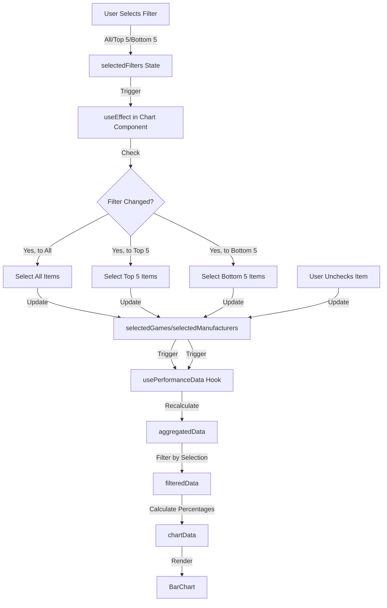
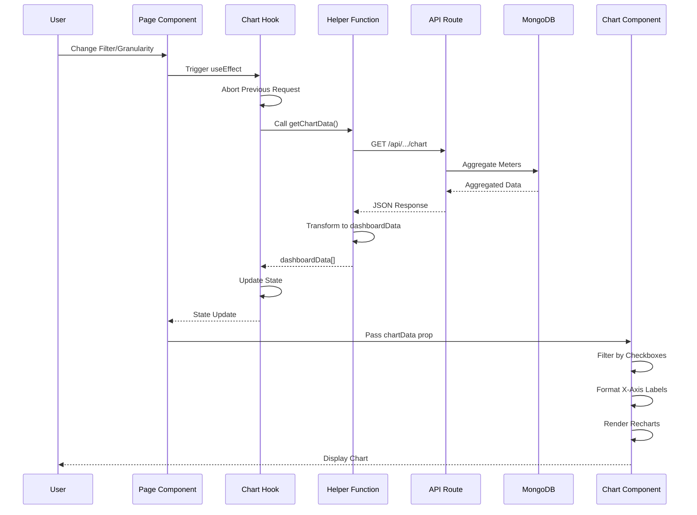
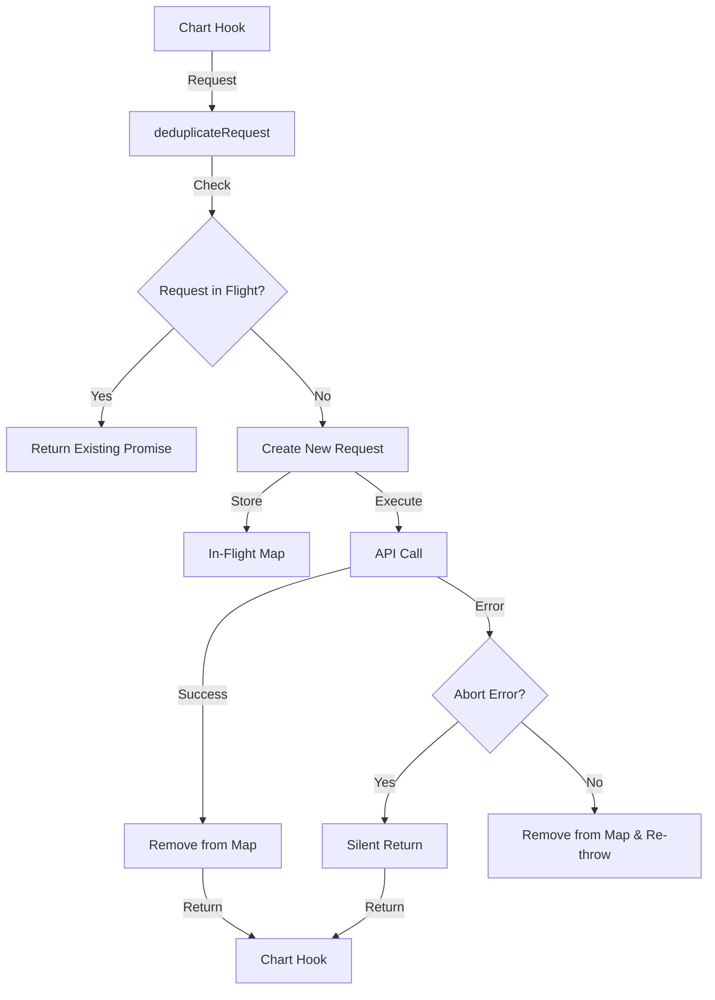

# Charts Implementation Guide

**Author:** Aaron Hazzard - Senior Software Engineer  
**Last Updated:** January 2026  
**Version:** 1.0.0

## Table of Contents

1. [Quick Start: Adding a Chart to a New Page](#quick-start-adding-a-chart-to-a-new-page)
2. [Dashboard Charts](#dashboard-charts)
3. [Location Details Charts](#location-details-charts)
4. [Cabinet Details Charts](#cabinet-details-charts)
5. [Reports Page - Meters Tab Charts](#reports-page---meters-tab-charts)
6. [Reports Page - Locations Tab Charts](#reports-page---locations-tab-charts)
7. [Reports Page - Evaluation Tab Charts](#reports-page---evaluation-tab-charts)
8. [Data Flow Diagrams](#data-flow-diagrams)
9. [Common Patterns](#common-patterns)
10. [Examples](#examples)

---

## Quick Start: Adding a Chart to a New Page

### Step-by-Step Guide

This guide walks you through adding a chart to a new page from scratch.

#### Step 1: Set Up Your Page Component

Create your page file with proper wrappers:

```typescript
'use client';

import ProtectedRoute from '@/components/auth/ProtectedRoute';
import PageErrorBoundary from '@/components/ui/errors/PageErrorBoundary';
import PageLayout from '@/components/layout/PageLayout';
import Chart from '@/components/ui/dashboard/Chart';
import DashboardDateFilters from '@/components/dashboard/DashboardDateFilters';
import { useDashBoardStore } from '@/lib/store/dashboardStore';
import { useCurrency } from '@/lib/contexts/CurrencyContext';
import { useAbortableRequest } from '@/lib/hooks/useAbortableRequest';
import { getMetrics } from '@/lib/helpers/metrics';
import { isAbortError } from '@/lib/utils/errorHandling';
import { getDefaultChartGranularity } from '@/lib/utils/chartGranularity';
import type { dashboardData } from '@/lib/types';
import type { TimePeriod } from '@/shared/types/common';
import { useState, useEffect, useMemo } from 'react';

function YourPageContent() {
  // Step 2: Get required state from stores
  const { selectedLicencee, activeMetricsFilter, customDateRange } = useDashBoardStore();
  const { displayCurrency } = useCurrency();
  const makeChartRequest = useAbortableRequest();

  // Step 3: Set up chart state
  const [chartData, setChartData] = useState<dashboardData[]>([]);
  const [loadingChartData, setLoadingChartData] = useState(true);
  const [chartGranularity, setChartGranularity] = useState<'hourly' | 'minute'>(
    () => getDefaultChartGranularity(activeMetricsFilter || 'Today')
  );

  // Step 4: Fetch chart data
  useEffect(() => {
    if (!activeMetricsFilter) return;

    makeChartRequest(async signal => {
      setLoadingChartData(true);
      try {
        const data = await getMetrics(
          activeMetricsFilter as TimePeriod,
          customDateRange?.startDate,
          customDateRange?.endDate,
          selectedLicencee,
          displayCurrency,
          signal,
          chartGranularity
        );
        setChartData(data);
      } catch (error) {
        if (isAbortError(error)) return;
        console.error('Error fetching chart data:', error);
        setChartData([]);
      } finally {
        setLoadingChartData(false);
      }
    });
  }, [
    activeMetricsFilter,
    customDateRange,
    selectedLicencee,
    displayCurrency,
    chartGranularity,
    makeChartRequest,
  ]);

  // Step 5: Determine if granularity selector should be shown
  const showGranularitySelector = useMemo(() => {
    return activeMetricsFilter === 'Today' || activeMetricsFilter === 'Yesterday';
  }, [activeMetricsFilter]);

  // Step 6: Render the chart
  return (
    <PageLayout
      headerProps={{
        selectedLicencee,
        setSelectedLicencee,
        disabled: loadingChartData,
      }}
      pageTitle="Your Page Title"
    >
      <div className="space-y-6">
        {/* Date Filters */}
        <DashboardDateFilters
          onCustomRangeGo={() => {/* Chart auto-refreshes via useEffect */}}
        />

        {/* Granularity Selector (optional) */}
        {showGranularitySelector && (
          <Select
            value={chartGranularity}
            onValueChange={(value) => setChartGranularity(value as 'hourly' | 'minute')}
          >
            <SelectTrigger className="w-[180px]">
              <SelectValue />
            </SelectTrigger>
            <SelectContent>
              <SelectItem value="hourly">Hourly</SelectItem>
              <SelectItem value="minute">Minute</SelectItem>
            </SelectContent>
          </Select>
        )}

        {/* Chart Component */}
        <Chart
          loadingChartData={loadingChartData}
          chartData={chartData}
          activeMetricsFilter={activeMetricsFilter || ''}
          granularity={chartGranularity}
        />
      </div>
    </PageLayout>
  );
}

export default function YourPage() {
  return (
    <ProtectedRoute requiredPage="reports"> {/* Use appropriate page permission */}
      <PageErrorBoundary>
        <YourPageContent />
      </PageErrorBoundary>
    </ProtectedRoute>
  );
}
```

### Key Points

1. **State Management:**
   - Use `useDashBoardStore` for filter state (`activeMetricsFilter`, `customDateRange`, `selectedLicencee`)
   - Use `useCurrency` for currency display
   - Use local state for chart-specific data (`chartData`, `loadingChartData`, `chartGranularity`)

2. **Data Fetching:**
   - Use `useAbortableRequest` hook to manage abort controllers
   - Use `getMetrics` helper for dashboard-style charts
   - Always handle abort errors silently with `isAbortError`

3. **Chart Component:**
   - Pass `loadingChartData` to show skeleton loader
   - Pass `chartData` array (transformed from API response)
   - Pass `activeMetricsFilter` for time period context
   - Pass `granularity` for proper X-axis formatting

4. **Granularity:**
   - Use `getDefaultChartGranularity` to determine initial granularity
   - Show granularity selector only for Today/Yesterday (or Custom ≤ 2 days)
   - Update granularity state when user changes selection

### Alternative: Using Existing Chart Hooks

If you're creating a location-specific or machine-specific chart, use existing hooks:

```typescript
// For location charts
const chartDataHook = useLocationChartData({
  locationId: 'your-location-id',
  selectedLicencee,
  activeMetricsFilter,
  customDateRange,
  activeView: 'machines',
});

// For cabinet/machine charts
const { chartData, loadingChart, chartGranularity, setChartGranularity } =
  useCabinetPageData();
```

### Complete Working Example

See `app/page.tsx` (Dashboard) for a complete working example with:

- Protected route wrapper
- Error boundary
- Chart data fetching
- Granularity selector
- Date filters
- Loading states

---

## Dashboard Charts

### Overview

The dashboard chart displays aggregated financial metrics across all locations for the selected licensee and time period.

### API Endpoint

**Endpoint:** `/api/metrics/meters`  
**Helper Function:** `getMetrics` in `lib/helpers/metrics.ts`  
**Hook:** `switchFilter` in `lib/utils/metrics.ts` (called by `fetchMetricsData`)

### Data Flow

```mermaid
flowchart TD
    A[User Changes Filter] -->|Trigger| B[fetchMetricsData]
    B -->|Parallel Fetch| C[fetchDashboardTotals]
    B -->|Parallel Fetch| D[switchFilter]
    D -->|Call| E[getMetrics]
    E -->|Request| F[/api/metrics/meters]
    F -->|Query| G[MongoDB Meters Collection]
    G -->|Aggregate| F
    F -->|Return JSON| E
    E -->|Transform| H[dashboardData Array]
    H -->|Set State| I[Chart Component]
    I -->|Render| J[Recharts AreaChart]
```

### Implementation Details

**File:** `lib/helpers/metrics.ts`

**Function Signature:**

```typescript
export async function getMetrics(
  timePeriod: TimePeriod,
  startDate?: Date | string,
  endDate?: Date | string,
  licencee?: string,
  displayCurrency?: string,
  signal?: AbortSignal,
  granularity?: 'hourly' | 'minute'
): Promise<dashboardData[]>;
```

**Query Parameters:**

- `timePeriod`: Today, Yesterday, 7d, 30d, Custom, etc.
- `startDate`: Custom start date (ISO string)
- `endDate`: Custom end date (ISO string)
- `licencee`: Licensee ID filter
- `currency`: Display currency code
- `granularity`: 'hourly' or 'minute' (for Today/Yesterday/Custom ≤ 2 days)

**API Response Example:**

```json
{
  "success": true,
  "data": [
    {
      "day": "2025-12-29",
      "time": "00:00",
      "drop": 150000,
      "totalCancelledCredits": 50000,
      "gross": 100000
    },
    {
      "day": "2025-12-29",
      "time": "01:00",
      "drop": 180000,
      "totalCancelledCredits": 60000,
      "gross": 120000
    }
  ]
}
```

**Data Transformation:**

```typescript
// API response → dashboardData
{
  xValue: `${item.day}T${item.time}:00`, // For sorting
  day: item.day,
  time: item.time,
  moneyIn: item.drop,
  moneyOut: item.totalCancelledCredits,
  gross: item.gross
}
```

### Granularity Options

- **Hourly**: Default for Today (if > 5 hours), Yesterday, Custom periods
- **Minute**: Available for Today (if ≤ 5 hours), Custom periods ≤ 2 days
- **Daily**: Default for 7d, 30d periods
- **Selector Visibility**: Shown for Today, Yesterday, Custom ≤ 2 days

### Checkbox Filtering

- Three checkboxes: Money In (purple), Money Out (blue), Gross (orange)
- All selected by default
- Client-side filtering (no API call needed)
- Filters data points with values > 0.01 for selected metrics

### Key Files

- `lib/helpers/metrics.ts` - `getMetrics` function
- `lib/utils/metrics.ts` - `switchFilter` function
- `lib/helpers/dashboard.ts` - `fetchMetricsData` orchestrator
- `components/ui/dashboard/Chart.tsx` - Chart component

---

## Location Details Charts

### Overview

Location details charts display aggregated financial metrics for all machines within a specific location. Uses different APIs depending on time period and granularity.

### API Endpoints

**Two API strategies:**

1. **Location Trends API** (for Custom periods and Quarterly/All Time with monthly/weekly):
   - Endpoint: `/api/analytics/location-trends`
   - Single request with server-side aggregation
   - Returns pre-aggregated location data

2. **Machine Chart API** (for Today/Yesterday/7d/30d):
   - Endpoint: `/api/machines/[machineId]/chart` (called per machine)
   - Multiple requests, aggregated client-side
   - Returns per-machine data

### Data Flow

```mermaid
flowchart TD
    A[User Changes Filter] -->|Trigger| B[useLocationChartData Hook]
    B -->|Check Period| C{Time Period?}
    C -->|Custom or Quarterly/All Time<br/>with monthly/weekly| D[location-trends API]
    C -->|Today/Yesterday/7d/30d| E[Fetch All Machines]
    E -->|For Each Machine| F[machine/[id]/chart API]
    F -->|Aggregate| G[Combine Results]
    D -->|Transform| H[dashboardData Array]
    G -->|Transform| H
    H -->|Set State| I[Chart Component]
    I -->|Render| J[Recharts AreaChart]
```

### Implementation Details

**File:** `lib/hooks/locations/useLocationChartData.ts`

**Hook Signature:**

```typescript
export function useLocationChartData({
  locationId: string;
  selectedLicencee: string | null;
  activeMetricsFilter: TimePeriod | null;
  customDateRange: DateRange | null;
  activeView: 'machines' | 'members';
})
```

**Returns:**

```typescript
{
  chartData: dashboardData[];
  loadingChartData: boolean;
  chartGranularity: 'hourly' | 'minute' | 'daily' | 'weekly' | 'monthly';
  setChartGranularity: (value) => void;
  showGranularitySelector: boolean;
  availableGranularityOptions: Array<'daily' | 'weekly' | 'monthly'>;
  refreshChart: () => void;
}
```

### Location Trends API Usage

**When Used:**

- Custom date range (any span)
- Quarterly period with monthly/weekly granularity
- All Time period with monthly/weekly granularity

**Request Example:**

```
GET /api/analytics/location-trends?locationIds=b5ad839c019641e9a8924b2d&timePeriod=Custom&startDate=2025-12-29&endDate=2025-12-30&granularity=hourly
```

**Response Example:**

```json
{
  "success": true,
  "trends": [
    {
      "day": "2025-12-29",
      "time": "00:00",
      "b5ad839c019641e9a8924b2d": {
        "handle": 10000,
        "winLoss": 5000,
        "jackpot": 1000,
        "plays": 500,
        "drop": 15000,
        "gross": 10000
      }
    }
  ]
}
```

**Transformation:**

```typescript
// Extract location-specific data from [locationId] key
const locationData = item[locationId];
if (typeof locationData === 'object' && locationData !== null) {
  return {
    xValue: item.time || item.day,
    day: item.day,
    time: item.time,
    moneyIn: locationData.drop || 0,
    moneyOut: locationData.handle || 0,
    gross: locationData.gross || 0,
  };
}
```

### Machine Chart API Usage

**When Used:**

- Today period
- Yesterday period
- 7d period
- 30d period

**Process:**

1. Fetch all machines for location (`fetchCabinetsForLocation`)
2. For each machine, call `/api/machines/[machineId]/chart`
3. Aggregate results client-side by time point
4. Transform to `dashboardData[]` format

**Request Example:**

```
GET /api/machines/abc123/chart?timePeriod=Today&granularity=hourly&currency=USD
```

**Response Example:**

```json
{
  "success": true,
  "data": [
    {
      "day": "2025-12-29",
      "time": "00:00",
      "drop": 5000,
      "totalCancelledCredits": 2000,
      "gross": 3000
    }
  ],
  "dataSpan": {
    "minDate": "2025-12-29T00:00:00.000Z",
    "maxDate": "2025-12-29T23:59:59.999Z"
  }
}
```

**Client-Side Aggregation:**

```typescript
// Aggregate across all machines for each time point
const aggregatedData = new Map<string, dashboardData>();
machines.forEach(machine => {
  machineChartData.forEach(point => {
    const key = `${point.day}_${point.time || ''}`;
    if (!aggregatedData.has(key)) {
      aggregatedData.set(key, {
        xValue: point.time || point.day,
        day: point.day,
        time: point.time,
        moneyIn: 0,
        moneyOut: 0,
        gross: 0,
      });
    }
    const aggregated = aggregatedData.get(key)!;
    aggregated.moneyIn += point.drop;
    aggregated.moneyOut += point.totalCancelledCredits;
    aggregated.gross += point.gross;
  });
});
```

### Granularity Options

- **Hourly**: Default for Today (> 5 hours), Yesterday, Custom ≤ 2 days
- **Minute**: Available for Today (≤ 5 hours), Custom ≤ 2 days
- **Daily**: Default for 7d, 30d periods
- **Weekly**: Available for Quarterly, All Time (requires server aggregation)
- **Monthly**: Available for Quarterly, All Time (requires server aggregation)

**Auto-Detection:**

- Calculates data span from `dataSpan` field (if available)
- If span > 5 hours, defaults to hourly
- If span ≤ 5 hours, defaults to minute
- User can manually override

### Refresh Functionality

**Function:** `refreshChart()`

**Implementation:**

```typescript
const refreshChart = useCallback(() => {
  setRefreshTrigger(prev => prev + 1); // Increment to force refetch
  lastFetchParamsRef.current = ''; // Clear cache
}, []);
```

**Usage:**

- Called when refresh button is clicked
- Forces chart data refetch
- Maintains current filter and granularity settings

### Key Files

- `lib/hooks/locations/useLocationChartData.ts` - Main chart hook
- `lib/helpers/cabinets.ts` - `fetchCabinetsForLocation` function
- `lib/helpers/machineChart.ts` - `getMachineChartData` function
- `app/api/analytics/location-trends/route.ts` - Location trends API
- `app/api/machines/[machineId]/chart/route.ts` - Machine chart API
- `components/locations/sections/LocationChartSection.tsx` - Chart section component

---

## Cabinet Details Charts

### Overview

Cabinet details charts display financial metrics for a single machine/cabinet over time.

### API Endpoint

**Endpoint:** `/api/machines/[machineId]/chart`  
**Helper Function:** `getMachineChartData` in `lib/helpers/machineChart.ts`  
**Hook:** `useCabinetPageData` in `lib/hooks/cabinets/useCabinetPageData.ts`

### Data Flow

```mermaid
flowchart TD
    A[User Changes Filter] -->|Trigger| B[useCabinetPageData Hook]
    B -->|Check Period| C{Short Period?}
    C -->|Today/Yesterday| D[Pass Granularity to API]
    C -->|Quarterly/All Time| E[Don't Pass Granularity]
    D -->|Request| F[/api/machines/[id]/chart]
    E -->|Request| F
    F -->|Query| G[MongoDB Meters Collection]
    G -->|Aggregate| F
    F -->|Return JSON| B
    B -->|Transform| H[dashboardData Array]
    H -->|Set State| I[Chart Component]
    I -->|Render| J[Recharts AreaChart]
```

### Implementation Details

**File:** `lib/hooks/cabinets/useCabinetPageData.ts`

**Chart Data Fetching:**

```typescript
useEffect(() => {
  if (!cabinet?._id || !activeMetricsFilter) return;

  makeChartRequest(async signal => {
    setLoadingChart(true);
    try {
      const isShortPeriod =
        activeMetricsFilter === 'Today' || activeMetricsFilter === 'Yesterday';
      const granularity = isShortPeriod ? chartGranularity : undefined;

      const result = await getMachineChartData(
        String(cabinet._id),
        activeMetricsFilter,
        customDateRange.startDate,
        customDateRange.endDate,
        displayCurrency,
        selectedLicencee,
        granularity,
        signal
      );

      if (result.data) {
        setChartData(result.data);
        setDataSpan(result.dataSpan || null);
      }
    } catch {
      setChartData([]);
    } finally {
      setLoadingChart(false);
    }
  });
}, [
  cabinet?._id,
  activeMetricsFilter,
  customDateRange?.startDate,
  customDateRange?.endDate,
  displayCurrency,
  selectedLicencee,
  chartGranularity,
  makeChartRequest,
]);
```

### API Request Details

**Helper Function:** `lib/helpers/machineChart.ts`

**Function Signature:**

```typescript
export async function getMachineChartData(
  machineId: string,
  timePeriod: TimePeriod,
  startDate?: Date | string,
  endDate?: Date | string,
  displayCurrency?: string,
  selectedLicencee?: string | null,
  granularity?: 'hourly' | 'minute' | 'daily' | 'weekly' | 'monthly',
  signal?: AbortSignal
): Promise<{
  data: dashboardData[];
  dataSpan?: {
    minDate: string;
    maxDate: string;
  };
}>;
```

**URL Construction:**

```typescript
let url = `/api/machines/${machineId}/chart?timePeriod=${timePeriod}`;

if (timePeriod === 'Custom' && startDate && endDate) {
  // Check if dates have time components
  const hasTime = /* check hours/minutes/seconds */;
  if (hasTime) {
    url += `&startDate=${formatLocalDateTimeString(sd, -4)}&endDate=${formatLocalDateTimeString(ed, -4)}`;
  } else {
    url += `&startDate=${sd.toISOString().split('T')[0]}&endDate=${ed.toISOString().split('T')[0]}`;
  }
}

if (displayCurrency) {
  url += `&currency=${displayCurrency}`;
}

if (granularity) {
  url += `&granularity=${granularity}`;
}
```

### API Response

**Response Format:**

```json
{
  "success": true,
  "data": [
    {
      "day": "2025-12-29",
      "time": "00:00",
      "drop": 5000,
      "totalCancelledCredits": 2000,
      "gross": 3000
    }
  ],
  "dataSpan": {
    "minDate": "2025-12-29T00:00:00.000Z",
    "maxDate": "2025-12-29T23:59:59.999Z"
  }
}
```

**Data Transformation:**

```typescript
// API response → dashboardData
const transformedData = response.data.data.map(item => ({
  xValue: item.time || item.day,
  day: item.day,
  time: item.time,
  moneyIn: item.drop,
  moneyOut: item.totalCancelledCredits,
  gross: item.gross,
}));
```

### Granularity Options

- **Hourly**: Default for Today (> 5 hours), Yesterday
- **Minute**: Available for Today (≤ 5 hours)
- **Daily**: Default for 7d, 30d periods
- **Weekly**: Available for Quarterly, All Time (passed to API)
- **Monthly**: Available for Quarterly, All Time (passed to API)

**Granularity Passing:**

- **Today/Yesterday**: Granularity passed to API (affects aggregation)
- **Quarterly/All Time**: Granularity passed to API (affects aggregation)
- **7d/30d**: Granularity not passed (API returns daily by default)

### Key Files

- `lib/hooks/cabinets/useCabinetPageData.ts` - Cabinet page data hook
- `lib/helpers/machineChart.ts` - `getMachineChartData` function
- `app/api/machines/[machineId]/chart/route.ts` - Machine chart API
- `components/cabinets/details/CabinetChartSection.tsx` - Chart section component

---

## Reports Page - Meters Tab Charts

### Overview

Meters tab charts display hourly aggregated data for selected locations, showing financial metrics over time.

### API Endpoint

**Endpoint:** `/api/reports/meters`  
**Query Parameter:** `includeHourlyData=true`  
**Hook:** `useMetersTabData` in `lib/hooks/reports/useMetersTabData.ts`

### Data Flow

```mermaid
flowchart TD
    A[User Selects Locations] -->|Trigger| B[useMetersTabData Hook]
    B -->|Build Params| C[Include includeHourlyData=true]
    C -->|Request| D[/api/reports/meters]
    D -->|Query| E[MongoDB Meters Collection]
    E -->|Aggregate Hourly| F[Group by Hour]
    F -->|Sum Movement Fields| D
    D -->|Return JSON| B
    B -->|Extract| G[hourlyChartData]
    G -->|Transform| H[Chart Data]
    H -->|Set State| I[Chart Component]
    I -->|Render| J[Recharts Chart]
```

### Implementation Details

**File:** `lib/hooks/reports/useMetersTabData.ts`

**Chart Data Fetching:**

```typescript
const fetchMetersData = useCallback(
  async (batch: number = 1) => {
    // ... setup code ...

    const params = new URLSearchParams({
      locations: selectedLocations.join(','),
      timePeriod: activeMetricsFilter,
      page: batch.toString(),
      limit: itemsPerBatch.toString(),
    });

    // Add hourly chart data request
    if (selectedLocations.length > 0) {
      params.append('includeHourlyData', 'true');
      params.append('granularity', chartGranularity);
      setHourlyChartLoading(true);
    }

    const response = await axios.get(`/api/reports/meters?${params}`, {
      signal,
    });

    if (response.data.hourlyChartData) {
      setHourlyChartData(response.data.hourlyChartData);
      setAllHourlyChartData(response.data.hourlyChartData);
    }
  },
  [
    /* dependencies */
  ]
);
```

### API Response

**Response Format:**

```json
{
  "success": true,
  "data": [
    /* meter data */
  ],
  "hourlyChartData": [
    {
      "hour": "2025-12-29T00:00:00.000Z",
      "totalDrop": 150000,
      "totalCancelledCredits": 50000,
      "totalGamesPlayed": 1000,
      "totalCoinIn": 200000,
      "totalCoinOut": 180000,
      "totalJackpot": 10000
    },
    {
      "hour": "2025-12-29T01:00:00.000Z",
      "totalDrop": 180000,
      "totalCancelledCredits": 60000,
      "totalGamesPlayed": 1200,
      "totalCoinIn": 220000,
      "totalCoinOut": 200000,
      "totalJackpot": 12000
    }
  ]
}
```

**Data Transformation:**

```typescript
// hourlyChartData → chart display format
const chartData = hourlyChartData.map(item => ({
  xValue: formatTime(new Date(item.hour)),
  day: formatDate(new Date(item.hour)),
  time: formatTime(new Date(item.hour)),
  moneyIn: item.totalDrop,
  moneyOut: item.totalCancelledCredits,
  gross: item.totalDrop - item.totalCancelledCredits,
}));
```

### Backend Aggregation

**File:** `app/api/reports/meters/route.ts`

**Aggregation Pipeline:**

```typescript
const hourlyAggregationPipeline = [
  {
    $match: {
      machine: { $in: machineIds },
      readAt: { $gte: queryStartDate, $lte: queryEndDate },
    },
  },
  {
    $group: {
      _id: {
        hour:
          granularity === 'minute'
            ? { $dateToString: { format: '%Y-%m-%d %H:%M', date: '$readAt' } }
            : { $dateToString: { format: '%Y-%m-%d %H:00', date: '$readAt' } },
      },
      totalDrop: { $sum: { $ifNull: ['$movement.drop', 0] } },
      totalCancelledCredits: {
        $sum: { $ifNull: ['$movement.totalCancelledCredits', 0] },
      },
      totalGamesPlayed: { $sum: { $ifNull: ['$movement.gamesPlayed', 0] } },
      totalCoinIn: { $sum: { $ifNull: ['$movement.coinIn', 0] } },
      totalCoinOut: { $sum: { $ifNull: ['$movement.coinOut', 0] } },
      totalJackpot: { $sum: { $ifNull: ['$movement.jackpot', 0] } },
    },
  },
  { $sort: { '_id.hour': 1 } },
];
```

**Key Points:**

- Uses `movement` fields (deltas), not absolute values
- Groups by hour (or minute if granularity='minute')
- Sums movement values across all selected machines
- Returns hourly buckets with aggregated totals

### Granularity Options

- **Hourly**: Default granularity
- **Minute**: Available when `granularity=minute` parameter passed
- **Selector**: Controlled by parent component

### Location Filtering

- Only aggregates data for machines in selected locations
- `locations` parameter: comma-separated location IDs
- API filters machines by `gamingLocation` field

### Key Files

- `lib/hooks/reports/useMetersTabData.ts` - Meters tab data hook
- `app/api/reports/meters/route.ts` - Meters report API
- `app/api/lib/helpers/metersReport.ts` - `getHourlyChartData` function

---

## Reports Page - Locations Tab Charts

### Overview

Locations tab charts display trend data for multiple selected locations, showing financial metrics over time with separate lines for each location.

### API Endpoint

**Endpoint:** `/api/analytics/location-trends`  
**Hook:** `useLocationsTabData` in `lib/hooks/reports/useLocationsTabData.ts`

### Data Flow

```mermaid
flowchart TD
    A[User Selects Locations] -->|Trigger| B[useLocationsTabData Hook]
    B -->|Build Params| C[locationIds=id1,id2,id3]
    C -->|Request| D[/api/analytics/location-trends]
    D -->|Query| E[MongoDB Meters Collection]
    E -->|Aggregate by Location| F[Group by Location + Time]
    F -->|Sum Metrics| D
    D -->|Return JSON| B
    B -->|Extract| G[trends Array]
    G -->|Transform| H[LocationTrendChart Data]
    H -->|Set State| I[LocationTrendChart Component]
    I -->|Render| J[Recharts LineChart]
```

### Implementation Details

**File:** `lib/hooks/reports/useLocationsTabData.ts`

**Chart Data Fetching:**

```typescript
// Chart data is fetched as part of location data fetch
const fetchLocationDataAsync = useCallback(
  async (specificLocations?: string[]) => {
    // ... location data fetch ...
    // Chart data is included in the location trends API response
    // when multiple locations are selected
  },
  [
    /* dependencies */
  ]
);
```

### API Request

**Request Example:**

```
GET /api/analytics/location-trends?locationIds=loc1,loc2,loc3&timePeriod=7d&granularity=hourly
```

**Query Parameters:**

- `locationIds`: Comma-separated location IDs
- `timePeriod`: Today, Yesterday, 7d, 30d, Custom, Quarterly, All Time
- `licencee`: Licensee filter (optional)
- `startDate`: Custom start date (for Custom period)
- `endDate`: Custom end date (for Custom period)
- `currency`: Display currency
- `granularity`: hourly, minute, daily, weekly, monthly

### API Response

**Response Format:**

```json
{
  "success": true,
  "trends": [
    {
      "day": "2025-12-29",
      "time": "00:00",
      "b5ad839c019641e9a8924b2d": {
        "handle": 10000,
        "winLoss": 5000,
        "jackpot": 1000,
        "plays": 500,
        "drop": 15000,
        "gross": 10000
      },
      "c05a7b1e03fab03fb69c9aff": {
        "handle": 20000,
        "winLoss": 10000,
        "jackpot": 2000,
        "plays": 1000,
        "drop": 30000,
        "gross": 20000
      }
    }
  ]
}
```

**Data Structure:**

- Each trend object represents one time point
- `day` and `time` fields identify the time point
- Each location ID is a key with its metrics object
- Multiple locations can be in the same trend object

### Chart Component

**Component:** `components/ui/LocationTrendChart.tsx`

**Usage:**

```typescript
<LocationTrendChart
  title="Money In"
  icon={<DollarSign />}
  data={trendsData}
  dataKey="drop"
  locations={selectedLocationIds}
  locationNames={locationNameMap}
  colors={locationColors}
  formatter={formatCurrency}
  isHourly={granularity === 'hourly' || granularity === 'minute'}
  timePeriod={activeMetricsFilter}
  granularity={chartGranularity}
/>
```

**Features:**

- Line chart (not area chart) for multiple locations
- Each location gets its own colored line
- Tooltip shows all locations' values for a time point
- Supports hourly, daily, weekly, monthly formatting

### Granularity Options

- **Hourly**: Default for Today, Yesterday, Custom ≤ 2 days
- **Minute**: Available for Today, Yesterday, Custom ≤ 2 days
- **Daily**: Default for 7d, 30d periods
- **Weekly**: Available for Quarterly, All Time
- **Monthly**: Available for Quarterly, All Time

**Backend Aggregation:**

- Weekly: Groups by week start (Monday) using `$dateSubtract`
- Monthly: Groups by month (`YYYY-MM` format)
- Returns pre-aggregated data points

### Key Files

- `lib/hooks/reports/useLocationsTabData.ts` - Locations tab data hook
- `app/api/analytics/location-trends/route.ts` - Location trends API
- `app/api/lib/helpers/locationTrends.ts` - Location trends helper
- `components/ui/LocationTrendChart.tsx` - Location trend chart component

---

## Reports Page - Evaluation Tab Charts

### Overview

The Evaluation tab features three specialized bar charts that display performance metrics grouped by manufacturer or game. These charts use percentage-based metrics to show relative contribution and support complex filtering (All, Top 5, Bottom 5) with individual item selection.

**Key Differences from Other Charts:**

- **Bar Charts** (not area/line charts) - Horizontal bar visualization
- **Percentage Metrics** - All values shown as percentages of total
- **Client-Side Aggregation** - Data aggregated from machine-level data, not API
- **Complex Filtering** - Top 5, Bottom 5, All options with checkbox selection
- **Multi-Metric Display** - Multiple metrics shown simultaneously on same chart

### Chart Types

1. **Manufacturer Performance Chart** - Groups by manufacturer
2. **Games Performance Chart** - Groups by game title (full metrics)
3. **Games Performance Revenue Chart** - Groups by game title (revenue-focused)

### Data Source

**No Direct API Endpoint** - Charts receive pre-aggregated data from parent component.

**Data Flow:**

```mermaid
flowchart TD
    A[MachinesTab] -->|Fetch| B[/api/machines/aggregation]
    B -->|Return| C[allMachines Array]
    C -->|Transform| D[evaluationData]
    D -->|Filter by Location| E[filteredEvaluationData]
    E -->|Group by Manufacturer| F[manufacturerData]
    E -->|Group by Game| G[gamesData]
    F -->|Pass as Props| H[ManufacturerPerformanceChart]
    G -->|Pass as Props| I[GamesPerformanceChart]
    G -->|Pass as Props| J[GamesPerformanceRevenueChart]
    H -->|Use Hook| K[useManufacturerPerformanceData]
    I -->|Use Hook| L[useGamesPerformanceData]
    J -->|Use Hook| M[useGamesRevenueData]
    K -->|Calculate Percentages| N[Chart Data]
    L -->|Calculate Percentages| N
    M -->|Calculate Percentages| N
    N -->|Render| O[Recharts BarChart]
```

### Manufacturer Performance Chart

**Component:** `components/ui/ManufacturerPerformanceChart.tsx`

**Hook:** `components/ui/ManufacturerPerformanceChart/useManufacturerPerformanceData.ts`

**Purpose:** Displays performance metrics grouped by manufacturer.

**Metrics Displayed:**

- Floor Positions % - Percentage of total machines
- Total Handle % - Percentage of total coin in
- Total Win % - Percentage of total net win
- Total Drop % - Percentage of total drop
- Total Cancelled Credits % - Percentage of total cancelled credits
- Total Gross % - Percentage of total gross revenue
- Total Games Played % - Percentage of total games played

**Data Structure:**

```typescript
type ManufacturerPerformanceData = {
  manufacturer: string;
  floorPositions: number;        // Percentage
  totalHandle: number;           // Percentage
  totalWin: number;              // Percentage
  totalDrop: number;            // Percentage
  totalCancelledCredits: number; // Percentage
  totalGross: number;            // Percentage
  totalGamesPlayed: number;      // Percentage
  rawTotals?: {                  // Absolute values for tooltip
    coinIn: number;
    netWin: number;
    drop: number;
    gross: number;
    cancelledCredits: number;
    gamesPlayed: number;
  };
  totalMetrics?: {               // Totals for percentage calculation
    coinIn: number;
    netWin: number;
    drop: number;
    gross: number;
    cancelledCredits: number;
    gamesPlayed: number;
  };
  machineCount?: number;
  totalMachinesCount?: number;
};
```

**Filtering Logic:**

```typescript
// Hook: useManufacturerPerformanceData
const aggregatedData = useMemo(() => {
  if (!allMachines.length) return initialData;

  let filteredMachines = allMachines;

  // Apply Top 5 / Bottom 5 filters
  if (!selectedFilters.includes('all-manufacturers')) {
    if (selectedFilters.includes('top-5-manufacturers')) {
      // Group by manufacturer, calculate totals, sort descending
      // Take top 5
    }
    if (selectedFilters.includes('bottom-5-manufacturers')) {
      // Group by manufacturer, calculate totals, sort ascending
      // Take bottom 5
    }
  }

  // Group filtered machines by manufacturer
  const groupByManufacturer = filteredMachines.reduce((acc, machine) => {
    const manufacturer = machine.manufacturer.trim();
    if (!acc[manufacturer]) acc[manufacturer] = [];
    acc[manufacturer].push(machine);
    return acc;
  }, {});

  // Calculate totals across all filtered machines
  const totalMetrics = filteredMachines.reduce((acc, machine) => ({
    coinIn: acc.coinIn + (machine.coinIn || 0),
    netWin: acc.netWin + (machine.netWin || 0),
    // ... other metrics
  }), { coinIn: 0, netWin: 0, ... });

  // Calculate percentages for each manufacturer
  return Object.keys(groupByManufacturer).map(manufacturer => {
    const machines = groupByManufacturer[manufacturer];
    const totals = machines.reduce((acc, machine) => ({
      coinIn: acc.coinIn + (machine.coinIn || 0),
      // ... aggregate
    }), { coinIn: 0, ... });

    return {
      manufacturer,
      floorPositions: (machines.length / filteredMachines.length) * 100,
      totalHandle: totalMetrics.coinIn > 0 
        ? (totals.coinIn / totalMetrics.coinIn) * 100 
        : 0,
      // ... other percentages
      rawTotals: totals,
      totalMetrics,
    };
  });
}, [allMachines, selectedFilters]);
```

**Checkbox Selection:**

- When "All Manufacturers" is selected, all manufacturers are automatically selected
- User can uncheck individual manufacturers even when "All" is selected
- When switching from "All" to "Top 5" or "Bottom 5", only those items are selected
- When switching back to "All", all manufacturers are re-selected

**Implementation:**

```typescript
// Sync selected manufacturers when filters change
useEffect(() => {
  if (aggregatedData.length === 0) return;

  const availableManufacturers = aggregatedData.map(d => d.manufacturer);
  
  // Check if filter changed
  const filterChanged = 
    prevFiltersRef.current.join(',') !== selectedFilters.join(',');
  const switchedToAll = 
    filterChanged && selectedFilters.includes('all-manufacturers');
  
  prevFiltersRef.current = selectedFilters;

  // If switched to "All Manufacturers", select all
  if (switchedToAll) {
    setSelectedManufacturers(availableManufacturers);
    return;
  }

  // Remove invalid selections
  const validSelections = selectedManufacturers.filter(mfr => 
    availableManufacturers.includes(mfr)
  );
  
  if (validSelections.length !== selectedManufacturers.length) {
    setSelectedManufacturers(validSelections);
  }
}, [aggregatedData, selectedFilters, selectedManufacturers]);
```

### Games Performance Chart

**Component:** `components/ui/GamesPerformanceChart.tsx`

**Hook:** `components/ui/GamesPerformanceChart/useGamesPerformanceData.ts`

**Purpose:** Displays performance metrics grouped by game title (full metrics).

**Metrics Displayed:**

- Floor Positions % - Percentage of total machines
- Total Handle % - Percentage of total coin in
- Total Win % - Percentage of total net win
- Total Drop % - Percentage of total drop
- Total Cancelled Credits % - Percentage of total cancelled credits
- Total Gross % - Percentage of total gross revenue
- Total Games Played % - Percentage of total games played

**Data Structure:** Same as Manufacturer Performance, but with `gameName` instead of `manufacturer`.

**Filtering Logic:** Identical to Manufacturer Performance, but groups by `gameTitle` instead of `manufacturer`.

**Key Implementation Details:**

```typescript
// Group by gameTitle (trimmed to ensure consistency)
const groupByGameName = filteredMachines
  .filter(machine => machine.gameTitle && machine.gameTitle.trim() !== '')
  .reduce((acc, machine) => {
    const gameName = machine.gameTitle.trim(); // Important: trim whitespace
    if (!acc[gameName]) acc[gameName] = [];
    acc[gameName].push(machine);
    return acc;
  }, {} as Record<string, MachineEvaluationData[]>);
```

### Games Performance Revenue Chart

**Component:** `components/ui/GamesPerformanceRevenueChart.tsx`

**Hook:** `components/ui/GamesPerformanceRevenueChart/useGamesRevenueData.ts`

**Purpose:** Displays revenue-focused metrics grouped by game title.

**Metrics Displayed:**

- Total Drop % - Percentage of total drop
- Total Cancelled Credits % - Percentage of total cancelled credits
- Total Gross % - Percentage of total gross revenue

**Data Structure:** Same as Games Performance, but only includes revenue metrics.

**Filtering Logic:** Identical to Games Performance Chart.

### Percentage Calculation

**Critical:** Percentages are calculated relative to `allMachines` prop, not just the filtered data.

**Why:** This ensures percentages show contribution relative to the total dataset (all selected locations), not just the filtered subset.

**Example:**

```typescript
// In useManufacturerPerformanceData hook
const totalMetrics = allMachines.reduce((acc, machine) => ({
  coinIn: acc.coinIn + (machine.coinIn || 0),
  netWin: acc.netWin + (machine.netWin || 0),
  // ... other metrics
}), { coinIn: 0, netWin: 0, ... });

// Calculate percentage for each manufacturer
totalHandle: totalMetrics.coinIn > 0 
  ? (totals.coinIn / totalMetrics.coinIn) * 100 
  : 0
```

**Important:** The `allMachines` prop passed to charts must be the same filtered dataset used to calculate `manufacturerData` and `gamesData` in `MachinesTab.tsx`. This ensures consistency.

### Chart Rendering

**Component Structure:**

```typescript
<ResponsiveContainer width="100%" height={400}>
  <BarChart
    data={chartData}
    layout="vertical"  // Horizontal bars
    margin={{ top: 20, right: 30, left: 20, bottom: 5 }}
  >
    <CartesianGrid strokeDasharray="3 3" />
    <XAxis type="number" domain={[0, 100]} />
    <YAxis 
      dataKey="manufacturerName" 
      type="category" 
      width={150}
    />
    <Tooltip content={<CustomTooltip />} />
    
    {/* Render bars for selected metrics only */}
    {selectedMetrics.includes('Floor Positions %') && (
      <Bar dataKey="Floor Positions %" fill="#8884d8" />
    )}
    {selectedMetrics.includes('Total Handle %') && (
      <Bar dataKey="Total Handle %" fill="#82ca9d" />
    )}
    {/* ... other metrics */}
  </BarChart>
</ResponsiveContainer>
```

**Metric Selection:**

- Users can check/uncheck individual metrics via checkboxes
- Only selected metrics are rendered as bars
- All metrics selected by default (except Revenue chart which only has 3)

### Filter Flow

**Complete Filter Flow:**



### Key Files

- `components/ui/ManufacturerPerformanceChart.tsx` - Manufacturer chart component
- `components/ui/GamesPerformanceChart.tsx` - Games chart component
- `components/ui/GamesPerformanceRevenueChart.tsx` - Games revenue chart component
- `components/ui/ManufacturerPerformanceChart/useManufacturerPerformanceData.ts` - Manufacturer data hook
- `components/ui/GamesPerformanceChart/useGamesPerformanceData.ts` - Games data hook
- `components/ui/GamesPerformanceRevenueChart/useGamesRevenueData.ts` - Games revenue data hook
- `components/reports/tabs/MachinesTab.tsx` - Parent component that provides data
- `components/reports/tabs/MachinesEvaluationTab.tsx` - Evaluation tab container

### Common Patterns

#### Data Trimming

All string fields (manufacturer, gameTitle) are trimmed to ensure consistency:

```typescript
const manufacturer = (machine.manufacturer || 'Unknown').trim();
const gameName = (machine.gameTitle || 'Unknown').trim();
```

This prevents mismatches like "Manufacturer A" vs "Manufacturer A " (with trailing space).

#### Percentage Calculation Formula

```typescript
percentage = (itemValue / totalValue) * 100

// Example:
totalHandle = totalMetrics.coinIn > 0 
  ? (totals.coinIn / totalMetrics.coinIn) * 100 
  : 0
```

#### Filter State Management

```typescript
// Track previous filters to detect changes
const prevFiltersRef = useRef<string[]>([]);

// Check if filter actually changed (not just a re-render)
const filterChanged = 
  prevFiltersRef.current.join(',') !== selectedFilters.join(',');

// Update previous filters
prevFiltersRef.current = selectedFilters;
```

---

## Data Flow Diagrams

### Complete Chart Data Flow



### Request Deduplication Flow



---

## Common Patterns

### Request Deduplication

**Purpose:** Prevent duplicate API calls when filters change rapidly.

**Implementation:**

```typescript
// lib/utils/requestDeduplication.ts
export async function deduplicateRequest<T>(
  key: RequestKey,
  requestFn: (signal: AbortSignal) => RequestPromise<T>
): Promise<T> {
  const normalizedKey = normalizeRequestKey(key);

  // Check if request is already in flight
  const existing = inFlightRequests.get(normalizedKey);
  if (existing) {
    return existing.promise as Promise<T>;
  }

  // Create new request
  const controller = new AbortController();
  const promise = requestFn(controller.signal)
    .then(result => {
      inFlightRequests.delete(normalizedKey);
      return result;
    })
    .catch(error => {
      inFlightRequests.delete(normalizedKey);

      // Silently handle abort errors
      if (isAbortError(error)) {
        return Promise.reject(new Error('ABORT_SILENT'));
      }

      throw error;
    });

  inFlightRequests.set(normalizedKey, { promise, controller });
  return promise;
}
```

**Usage:**

```typescript
const response = await deduplicateRequest(url, async abortSignal => {
  return axios.get(url, { signal: abortSignal });
});
```

### Abort Controller Usage

**Purpose:** Cancel previous requests when filters change.

**Implementation:**

```typescript
// lib/hooks/useAbortableRequest.ts
export function useAbortableRequest() {
  const abortControllerRef = useRef<AbortController | null>(null);

  return useCallback((requestFn: (signal: AbortSignal) => Promise<unknown>) => {
    // Abort previous request
    if (abortControllerRef.current) {
      abortControllerRef.current.abort();
    }

    // Create new abort controller
    const controller = new AbortController();
    abortControllerRef.current = controller;

    return requestFn(controller.signal);
  }, []);
}
```

**Usage:**

```typescript
const makeChartRequest = useAbortableRequest();

useEffect(() => {
  makeChartRequest(async signal => {
    const response = await axios.get(url, { signal });
    // ... handle response
  });
}, [dependencies]);
```

### Loading State Management

**Pattern:**

```typescript
const [loadingChartData, setLoadingChartData] = useState(true);

useEffect(() => {
  setLoadingChartData(true);

  makeChartRequest(async signal => {
    try {
      const data = await fetchChartData(signal);
      setChartData(data);
    } catch (error) {
      if (isAbortError(error)) {
        return; // Silently handle abort
      }
      // Handle actual error
    } finally {
      setLoadingChartData(false);
    }
  });
}, [dependencies]);
```

**Skeleton Display:**

```typescript
if (loadingChartData) {
  return <DashboardChartSkeleton />;
}
```

### Error Handling

**Abort Error Handling:**

```typescript
catch (error) {
  // Silently handle aborted requests - this is expected behavior when switching filters
  if (isAbortError(error)) {
    return; // Don't update state, don't show error
  }

  // Handle actual errors
  console.error('Error fetching chart data:', error);
  setError(errorMessage);
}
```

**Error Detection:**

```typescript
// lib/utils/errorHandling.ts
export function isAbortError(error: unknown): boolean {
  if (!error) return false;

  // Check axios cancellation
  if (axios.isCancel && axios.isCancel(error)) {
    return true;
  }

  // Check standard AbortError
  if (error instanceof Error) {
    if (
      error.name === 'AbortError' ||
      error.name === 'CanceledError' ||
      error.message.includes('aborted') ||
      error.message.includes('canceled')
    ) {
      return true;
    }
  }

  // Check error codes
  if (typeof error === 'object') {
    const errorObj = error as { code?: string };
    if (errorObj.code === 'ERR_CANCELED' || errorObj.code === 'ECONNABORTED') {
      return true;
    }
  }

  return false;
}
```

---

## Examples

### Example 1: Dashboard Chart Data

**Request:**

```
GET /api/metrics/meters?timePeriod=Today&licencee=c03b094083226f216b3fc39c&granularity=hourly
```

**Response:**

```json
{
  "success": true,
  "data": [
    {
      "day": "2025-12-29",
      "time": "00:00",
      "drop": 150000,
      "totalCancelledCredits": 50000,
      "gross": 100000
    },
    {
      "day": "2025-12-29",
      "time": "01:00",
      "drop": 180000,
      "totalCancelledCredits": 60000,
      "gross": 120000
    }
  ]
}
```

**Transformed Data:**

```typescript
[
  {
    xValue: '2025-12-29T00:00:00',
    day: '2025-12-29',
    time: '00:00',
    moneyIn: 150000,
    moneyOut: 50000,
    gross: 100000,
  },
  {
    xValue: '2025-12-29T01:00:00',
    day: '2025-12-29',
    time: '01:00',
    moneyIn: 180000,
    moneyOut: 60000,
    gross: 120000,
  },
];
```

### Example 2: Location Details Chart (Custom Period)

**Request:**

```
GET /api/analytics/location-trends?locationIds=b5ad839c019641e9a8924b2d&timePeriod=Custom&startDate=2025-12-29&endDate=2025-12-30&granularity=hourly
```

**Response:**

```json
{
  "success": true,
  "trends": [
    {
      "day": "2025-12-29",
      "time": "00:00",
      "b5ad839c019641e9a8924b2d": {
        "handle": 10000,
        "winLoss": 5000,
        "jackpot": 1000,
        "plays": 500,
        "drop": 15000,
        "gross": 10000
      }
    }
  ]
}
```

**Transformed Data:**

```typescript
[
  {
    xValue: '00:00',
    day: '2025-12-29',
    time: '00:00',
    moneyIn: 15000, // from drop
    moneyOut: 10000, // from handle
    gross: 10000,
  },
];
```

### Example 3: Monthly Granularity Data

**Request:**

```
GET /api/analytics/location-trends?locationIds=b5ad839c019641e9a8924b2d&timePeriod=Quarterly&granularity=monthly
```

**Response:**

```json
{
  "success": true,
  "trends": [
    {
      "day": "2025-10",
      "b5ad839c019641e9a8924b2d": {
        "drop": 450000,
        "gross": 300000
      }
    },
    {
      "day": "2025-11",
      "b5ad839c019641e9a8924b2d": {
        "drop": 500000,
        "gross": 350000
      }
    }
  ]
}
```

**Chart Display:**

- X-axis labels: "Oct 2025", "Nov 2025"
- No time field (monthly data)
- Data points represent entire month

### Example 4: Weekly Granularity Data

**Request:**

```
GET /api/analytics/location-trends?locationIds=b5ad839c019641e9a8924b2d&timePeriod=Quarterly&granularity=weekly
```

**Response:**

```json
{
  "success": true,
  "trends": [
    {
      "day": "2025-10-06",
      "b5ad839c019641e9a8924b2d": {
        "drop": 100000,
        "gross": 70000
      }
    },
    {
      "day": "2025-10-13",
      "b5ad839c019641e9a8924b2d": {
        "drop": 120000,
        "gross": 85000
      }
    }
  ]
}
```

**Chart Display:**

- X-axis labels: "Week 1 of Oct", "Week 2 of Oct"
- `day` field represents Monday of the week
- Calculates week number within the month

### Example 5: Checkbox Filtering

**Initial State:**

```typescript
selectedMetrics = ['Money In', 'Money Out', 'Gross'];
```

**User Unchecks "Money Out":**

```typescript
selectedMetrics = ['Money In', 'Gross'];
```

**Filtered Data:**

```typescript
// Only data points where moneyIn > 0.01 OR gross > 0.01 are shown
// Money Out line is hidden from chart
```

**Chart Rendering:**

```typescript
{selectedMetrics.includes('Money In') && (
  <Area dataKey="moneyIn" stroke="#a855f7" />
)}
{selectedMetrics.includes('Money Out') && (
  <Area dataKey="moneyOut" stroke="#3b82f6" />
)}
{selectedMetrics.includes('Gross') && (
  <Area dataKey="gross" stroke="#f97316" />
)}
```

---

## Additional Resources

### Related Documentation

- `Documentation/PAGE_SETUP_GUIDE.md` - **How to set up a new page with charts** (includes wrapper components, Suspense, error boundaries)
- `Documentation/CHARTS_ARCHITECTURE_GUIDE.md` - General chart concepts and architecture
- `Documentation/frontend/pages/dashboard.md` - Dashboard page documentation
- `Documentation/frontend/details/location-details.md` - Location details page documentation
- `Documentation/PERFORMANCE_OPTIMIZATION_GUIDE.md` - Performance optimization strategies

### Key Files Reference

**Chart Components:**

- `components/ui/dashboard/Chart.tsx` - Main chart component
- `components/ui/LocationTrendChart.tsx` - Location trend chart

**Hooks:**

- `lib/hooks/locations/useLocationChartData.ts` - Location chart hook
- `lib/hooks/cabinets/useCabinetPageData.ts` - Cabinet chart hook
- `lib/hooks/reports/useMetersTabData.ts` - Meters tab chart hook
- `lib/hooks/reports/useLocationsTabData.ts` - Locations tab chart hook

**Helpers:**

- `lib/helpers/metrics.ts` - Dashboard metrics helper
- `lib/helpers/machineChart.ts` - Machine chart helper
- `lib/utils/chartGranularity.ts` - Granularity utilities

**API Routes:**

- `app/api/metrics/meters/route.ts` - Dashboard metrics API
- `app/api/machines/[machineId]/chart/route.ts` - Machine chart API
- `app/api/analytics/location-trends/route.ts` - Location trends API
- `app/api/reports/meters/route.ts` - Meters report API

**API Helpers:**

- `app/api/lib/helpers/locationTrends.ts` - Location trends aggregation
- `app/api/lib/helpers/metersReport.ts` - Meters report aggregation
