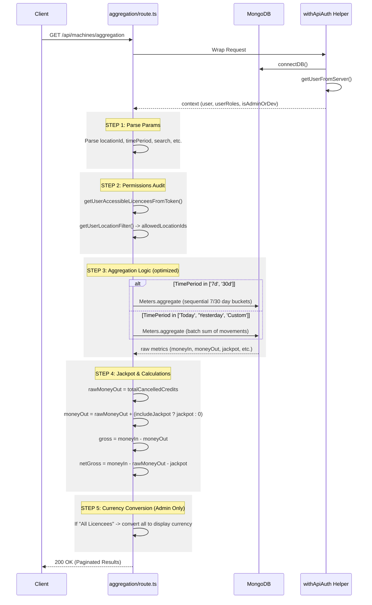

# API Flow: Machine Aggregation (`/api/machines/aggregation`)

This flows describes the high-level logic and checks for the machines aggregation API, which powers the Cabinets and Dashboard tables.

## Detailed Logical Steps

### 1. Data Parsing & Validation
- **Authentication**: Using `withApiAuth` wrapper to ensure DB connection and user identification via JWT token.
- **Param Handling**: Handles both `licencee` and `licencee` spellings. Supports multiple `locationId` and `gameType` provided as comma-separated lists.

### 2. Permissions & Filtering
- **RBAC**: Fetches all licencees the user has access to.
- **Location Intersection**: Intersects requested locations with the user's permission set.
- **Admin Bypass**: If a developer/admin specifically requests a `locationId`, we bypass the allowed-set restriction to ensure they can see forensic data.
- **Technician Mode**: If a user is **only** a technician, `timePeriod` is forced to `LastHour` to focus on recent data.

### 3. Aggregation Strategy
- **Sequential (7d/30d)**: Focuses on day-by-day buckets for trending.
- **Batch (Today/Yesterday/Custom)**: Highly optimized sum of the `movement` object fields (deltas). Unlike cumulative meters, this is immune to RAM clears and meter wraps.

### 4. Financial Rules (Jackpot Logic)
- **Base Total**: `movement.totalCancelledCredits` is stored as the "Base" cancelled credits.
- **Total Money Out**: Conditionally adds `movement.jackpot` ONLY IF the `includeJackpot` flag is active for the licencee.
- **Gross Profit**: `Money In - Total Money Out`.
- **Net Profit**: Always subtracts both Cancelled Credits and Jackpots, providing "true" profitability data for internal review.

### 5. Multi-Currency Support (Conversion)
- **Native Currency**: Each machine's data is natively stored in the licencee's native currency (e.g., GYD, TTD).
- **Admin Conversion**: To provide a unified view, the API converts values on-the-fly (`Native -> USD -> DisplayCurrency`) when viewing across all licencees.
