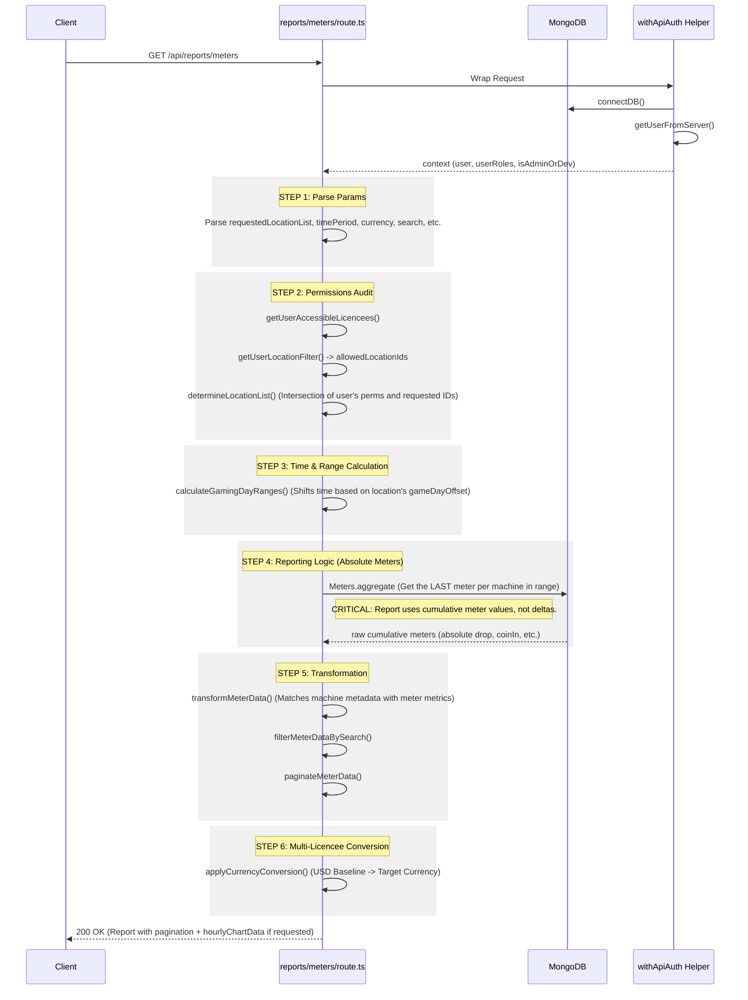

# API Flow: Meters Report (`/api/reports/meters`)

This flow describes the logic for generating the complex "Meters Report" used by casino managers for auditing.

## Detailed Logical Steps

### 1. Request Context & Permissions
- **Authenticated Wrappers**: The API uses `withApiAuth` to unify the auth/DB boilerplate.
- **Location Mapping**: Unlike aggregation, the Meters report specifically maps every machine to its location's **Gaming Day Offset** (e.g., 8 AM offset).

### 2. Gaming Day Normalization
- **Anchor Point**: Each location defines a `gameDayOffset` (e.g., 8).
- **Time Expansion**: If a user asks for "Today", the API actually queries from `Today 08:00 AM` to `Tomorrow 07:59:59 AM` in UTC-4 to ensure the operational business day is covered.

### 3. Aggregation Strategy: Absolute Meters
- **Absolute Values**: Unlike the dashboard (which uses deltas), the Meters Report is an audit tool. It finds the **last** meter read available in the requested range for each machine.
- **Why**: This represents the final state of the machine at the end of the shift/day.

### 4. Transformation & Paging
- **Machine Mapping**: Enriches the meter data with `serialNumber`, `custom.name`, and `manufacturer`.
- **In-Memory Search**: Filters the final result set by serial or asset numbers before pagination to ensure accuracy across all locations.

### 5. Multi-Licencee Currency Mapping
- **Admin Unified View**: If an admin views "All Licencees", the report converts all values to a common currency.
- **Native View**: If viewing a specific licencee, conversion is bypassed to show the native local currency of that operation.
