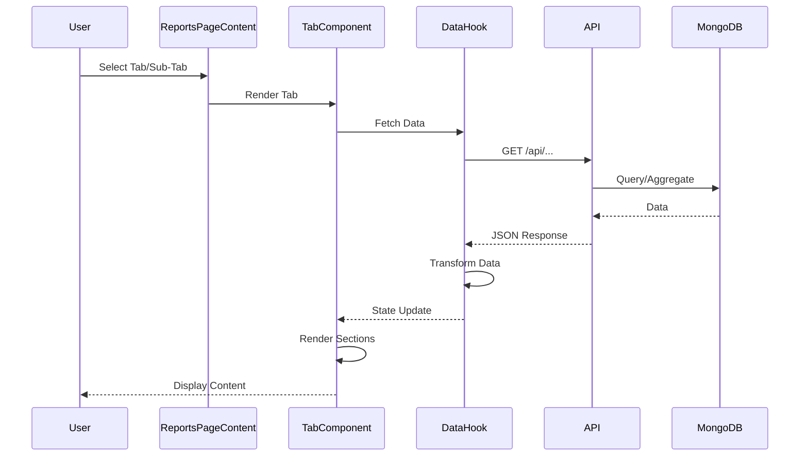

# Reports Page Documentation

**Author:** Aaron Hazzard - Senior Software Engineer  
**Last Updated:** December 30, 2025  
**Version:** 2.0.0

## Table of Contents

1. [Overview](#overview)
2. [Page Structure](#page-structure)
3. [Date Filters Section](#date-filters-section)
4. [Main Navigation Tabs](#main-navigation-tabs)
5. [Meters Tab](#meters-tab)
6. [Locations Tab](#locations-tab)
   - [Locations Overview Sub-Tab](#locations-overview-sub-tab)
   - [Locations SAS Evaluation Sub-Tab](#locations-sas-evaluation-sub-tab)
   - [Locations Revenue Analysis Sub-Tab](#locations-revenue-analysis-sub-tab)
7. [Machines Tab](#machines-tab)
   - [Machines Overview Sub-Tab](#machines-overview-sub-tab)
   - [Machines Evaluation Sub-Tab](#machines-evaluation-sub-tab)
   - [Machines Offline Sub-Tab](#machines-offline-sub-tab)
8. [Data Flow](#data-flow)
9. [Key Components](#key-components)
10. [Role-Based Access Control](#role-based-access-control)

---

## Overview

The Reports page (`/reports`) provides comprehensive analytics and performance evaluation for machines, locations, and meters. It features a multi-tab interface with role-based access control, real-time data updates, and advanced filtering capabilities.

### Key Features

- **Multi-tab Interface**: Three main tabs (Meters, Locations, Machines) with sub-tabs
- **Role-Based Access**: Different tabs visible based on user role (Developer, Admin, Location Admin)
- **Date Filtering**: Flexible date range selection with predefined and custom options
- **Location Filtering**: Multi-location selection for comparative analysis
- **Performance Charts**: Visual representation of performance metrics
- **Export Functionality**: Export reports to Excel or PDF
- **Real-time Updates**: Refresh functionality for all data sections
- **Responsive Design**: Mobile and desktop optimized layouts

### Page Route

**File:** `app/reports/page.tsx`

**URL:** `/reports?section={tab}&{subtab}={value}`

**Query Parameters:**

- `section`: Main tab (e.g., "machines", "locations", "meters")
- `mtab`: Machine sub-tab (e.g., "overview", "evaluation", "offline")
- `ltab`: Location sub-tab (e.g., "overview", "location-evaluation", "location-revenue")

---

## Page Structure

### Main Component Hierarchy

```
app/reports/page.tsx
  └── ProtectedRoute
      └── Suspense
          └── ReportsPageContent
              ├── PageLayout
              ├── ReportsDateFilters
              ├── ReportsNavigation
              └── Tab Content (ReportsMetersTab | ReportsLocationsTabWithErrorHandling | ReportsMachinesTab)
```

### Tab Navigation

The page uses Next.js router query parameters to manage tab state in `ReportsPageContent.tsx`:

```typescript
const router = useRouter();
const searchParams = useSearchParams();
const section = searchParams.get('section') || 'meters';
const mtab = searchParams.get('mtab') || 'overview';
const ltab = searchParams.get('ltab') || 'overview';
```

---

## Date Filters Section

**Component:** `components/reports/ReportsDateFilters.tsx`

**Purpose:** Provides date range filtering for all reports tabs with both predefined and custom date selection.

### Features

- **Predefined Periods**: Today, Yesterday, Last 7 Days, Last 30 Days (developers only), Quarterly (location tabs only), All Time
- **Custom Date Selection**: ModernCalendar component for custom date ranges
- **Tab-Specific Options**: Different filter options based on active tab
- **Single vs Range Mode**: Meters tab uses single date, other tabs use date range
- **Mobile Responsive**: Dropdown on mobile, buttons on desktop

### Available Filters by Tab

**Meters Tab:**

- Today
- Yesterday
- Custom (single date)

**Locations Tab:**

- Today
- Yesterday
- Last 7 Days
- Last 30 Days (developers only)
- Quarterly (SAS Evaluation and Revenue Analysis sub-tabs only)
- Custom (date range)
- All Time

**Machines Tab:**

- Today
- Yesterday
- Last 7 Days
- Last 30 Days (developers only)
- Custom (date range)
- All Time

### Implementation

```typescript
// Conditional filter buttons based on active tab
const getTimeFilterButtons = () => {
  const baseButtons = [
    { label: 'Today', value: 'Today' },
    { label: 'Yesterday', value: 'Yesterday' },
  ];

  // Only show 7/30 day filters for non-meters tabs
  if (activeView !== 'meters') {
    baseButtons.push({ label: 'Last 7 Days', value: '7d' });
    if (isDeveloper) {
      baseButtons.push({ label: 'Last 30 Days', value: '30d' });
    }
    // Show "Quarterly" only for location-evaluation and location-revenue tabs
    if (isLocationEvaluationOrRevenue) {
      baseButtons.push({ label: 'Quarterly', value: 'Quarterly' });
    }
  }

  baseButtons.push({ label: 'Custom', value: 'Custom' });

  if (activeView !== 'meters') {
    baseButtons.push({ label: 'All Time', value: 'All Time' });
  }

  return baseButtons;
};
```

---

## Main Navigation Tabs

**Component:** `components/reports/ReportsNavigation.tsx`

**Purpose:** Main tab navigation between Meters, Locations, and Machines tabs.

### Tab Configuration

**File:** `lib/constants/reports.ts`

```typescript
export const REPORTS_TABS_CONFIG: ReportTab[] = [
  {
    id: 'meters',
    label: 'Meters',
    icon: '📈',
    description: 'Meter readings and financial data by location',
  },
  {
    id: 'locations',
    label: 'Locations',
    icon: '🏢',
    description: 'Location performance analysis and comparisons',
  },
  {
    id: 'machines',
    label: 'Machines',
    icon: '🎰',
    description: 'Individual machine performance and revenue tracking',
  },
];
```

### Role-Based Visibility

- **Developers**: See all tabs (Meters, Locations, Machines)
- **Admins & Location Admins**: See Meters and Locations tabs only
- **Others**: See Meters tab only

---

## Meters Tab

**Component:** `components/reports/tabs/meters/ReportsMetersTab.tsx`

**Purpose:** Displays meter readings and financial data by location with charts and tables.

**No Sub-Tabs** - Single view with multiple sections.

### Sections

#### 1. Header Section

**Location:** Top of the tab

**Components:**

- Refresh button
- Export dropdown (PDF, Excel)

**Features:**

- Refresh button reloads all data
- Export button disabled when no data
- Mobile-responsive layout

#### 2. Location Selection & Charts Section

**Component:** `components/reports/tabs/meters/ReportsMetersLocationSelection.tsx`

**Purpose:** Location selection, top performing machines pie chart, and hourly charts.

**Sub-Sections:**

##### 2.1 Location Multi-Select

- Multi-select dropdown for locations
- Auto-selects single location if only one available
- Filters all data by selected locations

##### 2.2 Top Performing Machines Pie Chart

**Data Source:** Calculated from `allMetersData`

**Display:**

- Pie chart showing top 5 machines by drop amount
- Shows machine ID and percentage contribution
- Color-coded segments

**Calculation:**

```typescript
const topMachines = calculateTopMachines(allMetersData);
// Sorts by drop amount, takes top 5, calculates percentages
```

##### 2.3 Hourly Charts

**Component:** Uses `Chart` component from `components/ui/dashboard/Chart.tsx`

**Metrics Displayed:**

- Money In (Drop)
- Money Out (Total Cancelled Credits)
- Gross (Money In - Money Out)

**Granularity Options:**

- Hourly (default)
- Minute (available for Today/Yesterday/Custom ≤ 2 days)

**Data Source:** `hourlyChartData` from `useMetersTabData` hook

**API Endpoint:** `/api/reports/meters?includeHourlyData=true&granularity={granularity}`

#### 3. Meters Table Section

**Component:** `components/reports/tabs/meters/ReportsMetersTable.tsx`

**Purpose:** Displays meter data in table format with search and pagination.

**Features:**

- **Search**: Search by Serial Number, Custom Name, or Location
- **Desktop View**: Full table with all columns
- **Mobile View**: Card-based layout
- **Pagination**: 10 items per page
- **Machine Links**: Clickable machine IDs navigate to machine details

**Columns:**

- Machine ID (clickable link)
- Location
- Meters In (Coin In)
- Meters Out (Coin Out)
- Jackpot
- Bill In (Drop)
- Voucher Out (Net Cancelled Credits)
- Att Paid Credits (Hand Paid Cancelled Credits)
- Games Played
- Last Activity

**Data Source:** `paginatedMetersData` from `useMetersTabData` hook

**API Endpoint:** `/api/reports/meters`

### Data Flow

```mermaid
flowchart TD
    A[User Selects Locations] -->|Trigger| B[useMetersTabData Hook]
    B -->|Request| C[/api/reports/meters]
    C -->|Return| D[allMetersData + hourlyChartData]
    D -->|Calculate| E[Top Machines]
    D -->|Paginate| F[paginatedMetersData]
    E -->|Display| G[Pie Chart]
    D -->|Display| H[Hourly Charts]
    F -->|Display| I[ReportsMetersTable]
```

### Key Features

- **Batch Loading**: Loads data in batches of 50 items
- **Search Debouncing**: 500ms debounce on search input
- **Auto-Location Selection**: Auto-selects if only one location available
- **Default Period**: Defaults to "Yesterday" on initial load
- **Export**: Exports filtered data to PDF or Excel

---

## Locations Tab

**Component:** `components/reports/tabs/locations/ReportsLocationsTab.tsx`

**Purpose:** Location performance analysis with three sub-tabs for different perspectives.

**Sub-Tabs:**

1. Overview
2. SAS Evaluation
3. Revenue Analysis

### Tab Navigation

**URL Parameters:**

- `section=locations&ltab=overview` - Overview tab
- `section=locations&ltab=location-evaluation` - SAS Evaluation tab
- `section=locations&ltab=location-revenue` - Revenue Analysis tab

---

## Locations Overview Sub-Tab

**Component:** `components/reports/tabs/locations/ReportsLocationsOverview.tsx`

**Purpose:** Displays overview of all locations with metrics, map, and top locations.

### Sections

#### 1. Summary Metrics Cards Section

**Location:** Top of the tab

**Metrics Displayed:**

- **Money In**: Total drop across all locations
- **Money Out**: Total cancelled credits across all locations
- **Gross**: Net revenue (Money In - Money Out)

**Features:**

- Color-coded cards (green for positive, red for negative)
- Loading skeleton states
- Currency formatting

**Data Source:** `metricsTotals` from `useLocationsTabData` hook

#### 2. Location Map Section

**Component:** `components/reports/tabs/locations/ReportsLocationsMap.tsx`

**Purpose:** Interactive map showing all locations with performance indicators.

**Features:**

- **Interactive Map**: Leaflet-based map with markers
- **Search Functionality**: Search bar overlay on map
- **Location Markers**: Color-coded by performance level
- **Popup Details**: Click markers to see location details
- **Performance Indicators**: Visual indicators for gross revenue
- **Zoom Controls**: Map zoom and pan controls

**Performance Levels:**

- Excellent (green)
- Good (blue)
- Average (yellow)
- Poor (red)

**Data Source:** `gamingLocations` and `locationAggregates` from `useLocationsTabData` hook

#### 3. Top 5 Locations Section

**Location:** Below map

**Purpose:** Displays top 5 performing locations by gross revenue.

**Display:**

- Card-based layout
- Location name
- Gross revenue amount
- Progress bar showing relative performance
- Percentage of total

**Data Source:** `topLocations` from `useLocationsTabData` hook

#### 4. Location Table Section

**Component:** `components/reports/tabs/locations/ReportsLocationsTable.tsx`

**Purpose:** Comprehensive table of all locations with metrics and pagination.

**Features:**

- **Pagination**: Server-side pagination
- **Sortable Columns**: Click headers to sort
- **Location Details**: Click location name to navigate to details
- **Financial Metrics**: Money In, Money Out, Gross displayed
- **Machine Counts**: Total machines, online machines, SAS machines

**Columns:**

- Location Name (clickable)
- Money In
- Money Out
- Gross
- Total Machines
- Online Machines
- SAS Machines
- Non-SAS Machines

**Data Source:** `paginatedLocations` from `useLocationsTabData` hook

**API Endpoint:** `/api/locationAggregation`

#### 5. Export Section

**Location:** Top right of tab

**Features:**

- Export to PDF
- Export to Excel
- Includes all visible data

---

## Locations SAS Evaluation Sub-Tab

**Component:** `components/reports/tabs/locations/ReportsLocationsSASEvaluation.tsx`

**Purpose:** SAS-enabled locations evaluation with charts and top machines.

### Sections

#### 1. Location Selection Section

**Component:** `LocationMultiSelect`

**Purpose:** Select up to 3 SAS-enabled locations for comparison.

**Features:**

- Filters to show only SAS locations (`sasEvaluationOnly=true`)
- Maximum 3 locations selectable
- Auto-populates with all SAS locations by default
- Location names displayed in dropdown

**Data Source:** `allLocationsForDropdown` filtered by SAS status

#### 2. Summary Metrics Cards Section

**Location:** Below location selection

**Metrics Displayed:**

- **Money In**: Total drop for selected locations
- **Money Out**: Total cancelled credits for selected locations
- **Gross**: Net revenue for selected locations

**Features:**

- Color-coded cards
- Loading states
- Currency formatting

**Data Source:** `metricsTotals` from `useLocationsTabData` hook

#### 3. Location Evaluation Table Section

**Component:** `components/reports/tabs/locations/ReportsLocationsTable.tsx`

**Purpose:** Table showing selected locations with detailed metrics.

**Features:**

- Displays only selected locations
- Sortable columns
- Click location name to navigate to details
- Financial metrics per location

**Data Source:** `paginatedLocations` filtered by `selectedSasLocations`

#### 4. Location Trend Charts Section

**Component:** `components/reports/tabs/locations/ReportsLocationTrendChart.tsx`

**Purpose:** Line charts showing trends for selected locations over time.

**Charts Displayed:**

1. **Money In Chart** - Drop trends
2. **Win/Loss Chart** - Win/Loss trends
3. **Jackpot Chart** - Jackpot trends
4. **Plays Chart** - Games played trends

**Features:**

- **Multiple Lines**: One line per selected location
- **Color-Coded**: Each location has unique color
- **Tooltip**: Shows all locations' values at time point
- **Granularity Control**: Hourly, minute, daily, weekly, monthly
- **Time Period Support**: Today, Yesterday, 7d, 30d, Quarterly, All Time

**Data Source:** `locationTrendData` from `useLocationsTabData` hook

**API Endpoint:** `/api/analytics/location-trends`

**Granularity Options:**

- **Hourly**: Default for Today, Yesterday, Custom ≤ 2 days
- **Minute**: Available for Today, Yesterday, Custom ≤ 2 days
- **Daily**: Default for 7d, 30d
- **Weekly**: Available for Quarterly, All Time
- **Monthly**: Available for Quarterly, All Time

#### 5. Top 5 Machines Table Section

**Location:** Below charts

**Purpose:** Displays top 5 performing machines across selected locations.

**Features:**

- Sortable columns
- Machine details with links
- Financial metrics
- Performance indicators

**Columns:**

- Machine ID (clickable)
- Location
- Money In
- Money Out
- Gross
- Games Played
- Performance Rating

**Data Source:** `topMachinesData` from `useLocationsTabData` hook

#### 6. Export Section

**Location:** Top right of tab

**Features:**

- Export to PDF
- Export to Excel
- Includes all visible data and charts

---

## Locations Revenue Analysis Sub-Tab

**Component:** `components/reports/tabs/locations/ReportsLocationsRevenueAnalysis.tsx`

**Purpose:** Revenue analysis with location selection, metrics, charts, and revenue table.

### Sections

#### 1. Location Selection Section

**Component:** `LocationMultiSelect`

**Purpose:** Select up to 3 locations for revenue comparison.

**Features:**

- All locations available (not just SAS)
- Maximum 3 locations selectable
- Auto-populates with all locations by default

**Data Source:** `allLocationsForDropdown`

#### 2. Summary Metrics Cards Section

**Location:** Below location selection

**Metrics Displayed:**

- **Money In**: Total drop for selected locations
- **Money Out**: Total cancelled credits for selected locations
- **Gross**: Net revenue for selected locations

**Features:**

- Color-coded cards
- Loading states
- Currency formatting

**Data Source:** `metricsTotals` from `useLocationsTabData` hook

#### 3. Revenue Analysis Table Section

**Component:** `components/reports/tabs/locations/ReportsLocationsRevenueTable.tsx`

**Purpose:** Detailed revenue analysis table for selected locations.

**Features:**

- Displays only selected locations
- Sortable columns
- Click location name to navigate to details
- Revenue metrics per location
- Comparison view

**Data Source:** `paginatedLocations` filtered by `selectedRevenueLocations`

#### 4. Revenue Trend Charts Section

**Component:** `components/reports/tabs/locations/ReportsLocationTrendChart.tsx`

**Purpose:** Line charts showing revenue trends for selected locations.

**Charts Displayed:**

1. **Money In Chart** - Drop trends
2. **Win/Loss Chart** - Win/Loss trends
3. **Jackpot Chart** - Jackpot trends

**Features:**

- **Multiple Lines**: One line per selected location
- **Color-Coded**: Each location has unique color
- **Tooltip**: Shows all locations' values at time point
- **Granularity Control**: Hourly, minute, daily, weekly, monthly
- **Time Period Support**: Today, Yesterday, 7d, 30d, Quarterly, All Time

**Data Source:** `locationTrendData` from `useLocationsTabData` hook

**API Endpoint:** `/api/analytics/location-trends`

#### 5. Export Section

**Location:** Top right of tab

**Features:**

- Export to PDF
- Export to Excel
- Includes all visible data and charts

---

## Machines Tab

**Component:** `components/reports/tabs/machines/ReportsMachinesTab.tsx`

**Purpose:** Individual machine performance and revenue tracking with three sub-tabs.

**Sub-Tabs:**

1. Overview
2. Evaluation
3. Offline

### Tab Navigation

**URL Parameters:**

- `section=machines&mtab=overview` - Overview tab
- `section=machines&mtab=evaluation` - Evaluation tab
- `section=machines&mtab=offline` - Offline tab

---

## Machines Overview Sub-Tab

**Component:** `components/reports/tabs/machines/ReportsMachinesOverview.tsx`

**Purpose:** Overview of all machines with statistics, charts, and table.

### Sections

#### 1. Machine Statistics Cards Section

**Location:** Top of the tab

**Metrics Displayed:**

- **Total Machines**: Count of all machines
- **Online Machines**: Machines with recent activity
- **Offline Machines**: Machines without recent activity
- **Total Revenue**: Gross revenue across all machines

**Features:**

- Color-coded cards
- Loading skeleton states
- Real-time updates

**Data Source:** `machineStats` from `useLocationMachineStats` hook

#### 2. Filters Section

**Location:** Below statistics cards

**Components:**

- **Search Input**: Search by machine ID, serial number, or location
- **Location Filter**: Single-select dropdown (All or specific location)
- **Online Status Filter**: All, Online, Offline

**Features:**

- Debounced search (500ms)
- Real-time filtering
- Combined filter logic

#### 3. Machines Table Section

**Location:** Main content area

**Purpose:** Comprehensive table of all machines with metrics and actions.

**Features:**

- **Sortable Columns**: Click headers to sort
- **Machine Links**: Click machine ID to navigate to details
- **Edit/Delete Actions**: Action buttons for each machine
- **Pagination**: 10 items per page
- **Financial Color Coding**: Color-coded financial metrics

**Columns:**

- Machine ID (clickable)
- Location
- Manufacturer
- Game Title
- Money In
- Money Out
- Gross
- Games Played
- Online Status
- Actions (Edit, Delete)

**Data Source:** `allOverviewMachines` from `useMachinesTabData` hook

**API Endpoint:** `/api/machines/aggregation`

#### 4. Export Section

**Location:** Top right of tab

**Features:**

- Export to PDF
- Export to Excel
- Includes filtered data

---

## Machines Evaluation Sub-Tab

**Component:** `components/reports/tabs/machines/ReportsMachinesEvaluation.tsx`

**Purpose:** Machine performance evaluation with charts, summary statistics, and top/bottom machines.

### Sections

#### 1. Location Selection Section

**Component:** `LocationMultiSelect`

**Purpose:** Select one or more locations to filter evaluation data.

**Features:**

- Multi-select dropdown
- Filters all charts and tables
- Recalculates percentages based on selected locations

#### 2. Summary Section

**Component:** `components/reports/tabs/machines/ReportsMachinesEvaluationSummary/ReportsMachinesEvaluationSummary.tsx`

**Purpose:** Displays Pareto analysis statements.

**Metrics Displayed:**

- **Handle Statement**: "X% of Handle comes from Y% of machines"
- **Win Statement**: "X% of Win comes from Y% of machines"
- **Games Played Statement**: "X% of Games Played comes from Y% of machines"

**Features:**

- Expandable details
- Shows concentration of performance
- Calculated from filtered machines

**Data Source:** `summaryCalculations` from `ReportsMachinesTab` component

#### 3. Manufacturer Performance Chart Section

**Component:** `components/reports/tabs/machines/ManufacturerPerformanceChart/ManufacturerPerformanceChart.tsx`

**Purpose:** Bar chart showing performance metrics grouped by manufacturer.

**Metrics Displayed:**

- Floor Positions %
- Total Handle %
- Total Win %
- Total Drop %
- Total Cancelled Credits %
- Total Gross %
- Total Games Played %

**Features:**

- **Filtering**: All Manufacturers, Top 5, Bottom 5
- **Checkbox Selection**: Select/deselect individual manufacturers
- **Percentage Calculation**: Based on totals from all selected locations
- **Search**: Search manufacturers by name
- **Focus**: Focus on specific manufacturer bars

**Data Source:** `manufacturerData` from `ReportsMachinesTab` component

**Hook:** `useManufacturerPerformanceData`

See [CHARTS_IMPLEMENTATION_GUIDE.md](../../CHARTS_IMPLEMENTATION_GUIDE.md#reports-page---evaluation-tab-charts) for detailed chart documentation.

#### 4. Games Performance Chart Section

**Component:** `components/reports/tabs/machines/GamesPerformanceChart/GamesPerformanceChart.tsx`

**Purpose:** Bar chart showing performance metrics grouped by game title.

**Metrics Displayed:**

- Floor Positions %
- Total Handle %
- Total Win %
- Total Drop %
- Total Cancelled Credits %
- Total Gross %
- Total Games Played %

**Features:**

- **Filtering**: All Games, Top 5, Bottom 5
- **Checkbox Selection**: Select/deselect individual games
- **Percentage Calculation**: Based on totals from all selected locations
- **Search**: Search games by name
- **Focus**: Focus on specific game bars

**Data Source:** `gamesData` from `ReportsMachinesTab` component

**Hook:** `useGamesPerformanceData`

#### 5. Games Performance Revenue Chart Section

**Component:** `components/reports/tabs/machines/GamesPerformanceRevenueChart/GamesPerformanceRevenueChart.tsx`

**Purpose:** Bar chart showing revenue-focused metrics grouped by game title.

**Metrics Displayed:**

- Total Drop %
- Total Cancelled Credits %
- Total Gross %

**Features:**

- **Filtering**: All Games, Top 5, Bottom 5
- **Checkbox Selection**: Select/deselect individual games
- **Percentage Calculation**: Based on totals from all selected locations
- **Search**: Search games by name
- **Focus**: Focus on specific game bars

**Data Source:** `gamesData` from `ReportsMachinesTab` component

**Hook:** `useGamesRevenueData`

#### 6. Top Machines Table Section

**Location:** Below charts

**Purpose:** Displays top performing machines by various criteria.

**Features:**

- **Sortable Columns**: Handle, Win, Drop, Gross, Games Played, Jackpot
- **Machine Links**: Click machine ID to navigate to details
- **Financial Metrics**: All key performance indicators
- **Performance Rating**: Color-coded performance indicators

**Columns:**

- Machine ID (clickable)
- Location
- Manufacturer
- Game Title
- Handle
- Win
- Drop
- Gross
- Games Played
- Jackpot

**Data Source:** `topMachines` calculated from `filteredEvaluationData`

#### 7. Bottom Machines Table Section

**Location:** Below top machines table

**Purpose:** Displays worst performing machines by various criteria.

**Features:**

- **Sortable Columns**: Handle, Win, Drop, Gross, Games Played, Jackpot
- **Machine Links**: Click machine ID to navigate to details
- **Financial Metrics**: All key performance indicators
- **Performance Rating**: Color-coded performance indicators

**Columns:** Same as Top Machines Table

**Data Source:** `bottomMachines` calculated from `filteredEvaluationData`

#### 8. Export Section

**Location:** Top right of tab

**Features:**

- Export to PDF
- Export to Excel
- Includes all charts and tables

---

## Machines Offline Sub-Tab

**Component:** `components/reports/tabs/machines/ReportsMachinesOffline.tsx`

**Purpose:** Management and analysis of offline machines.

### Sections

#### 1. Filters Section

**Location:** Top of the tab

**Components:**

- **Location Multi-Select**: Select multiple locations to filter
- **Search Input**: Search by machine ID, serial number, or location
- **Offline Duration Filter**: All, < 1 hour, 1-6 hours, 6-24 hours, > 24 hours

**Features:**

- Debounced search (500ms)
- Combined filter logic
- Real-time filtering

#### 2. Machine Statistics Section

**Location:** Below filters

**Metrics Displayed:**

- **Total Offline Machines**: Count of offline machines
- **Average Offline Duration**: Average hours offline
- **Longest Offline**: Machine with longest offline duration

**Features:**

- Color-coded cards
- Loading states
- Calculated from filtered data

**Data Source:** `allOfflineMachines` from `useMachinesTabData` hook

#### 3. Offline Machines Table Section

**Location:** Main content area

**Purpose:** Table of all offline machines with details and actions.

**Features:**

- **Sortable Columns**: Click headers to sort
- **Machine Links**: Click machine ID to navigate to details
- **Edit/Delete Actions**: Action buttons for each machine
- **Pagination**: 10 items per page
- **Offline Duration**: Calculated hours offline
- **Last Activity**: Timestamp of last activity

**Columns:**

- Machine ID (clickable)
- Location
- Manufacturer
- Game Title
- Last Activity
- Offline Duration (hours)
- Actions (Edit, Delete)

**Data Source:** `allOfflineMachines` filtered by search, location, and duration

**API Endpoint:** `/api/machines/aggregation` with offline filter

#### 4. Export Section

**Location:** Top right of tab

**Features:**

- Export to PDF
- Export to Excel
- Includes filtered data

---

## Data Flow

### Complete Data Flow Diagram



### Tab-Specific Data Flows

#### Meters Tab Data Flow

```mermaid
flowchart TD
    A[User Selects Locations] -->|Trigger| B[useMetersTabData]
    B -->|Request| C[/api/reports/meters]
    C -->|Return| D[allMetersData + hourlyChartData]
    D -->|Calculate| E[Top Machines]
    D -->|Paginate| F[paginatedMetersData]
    E -->|Display| G[Pie Chart]
    D -->|Display| H[Hourly Charts]
    F -->|Display| I[ReportsMetersTable]
```

#### Locations Tab Data Flow

```mermaid
flowchart TD
    A[User Selects Locations] -->|Trigger| B[useLocationsTabData]
    B -->|Request| C[/api/locationAggregation]
    C -->|Return| D[paginatedLocations]
    B -->|Request| E[/api/analytics/location-trends]
    E -->|Return| F[locationTrendData]
    D -->|Display| G[ReportsEnhancedLocationTable]
    F -->|Display| H[Trend Charts]
    D -->|Calculate| I[Top Locations]
    I -->|Display| J[Top 5 Section]
```

#### Machines Tab Data Flow

```mermaid
flowchart TD
    A[User Selects Tab] -->|Trigger| B[useMachinesTabData]
    B -->|Request| C[/api/machines/aggregation]
    C -->|Return| D[allMachines]
    D -->|Transform| E[evaluationData]
    E -->|Filter| F[filteredEvaluationData]
    F -->|Group| G[manufacturerData]
    F -->|Group| H[gamesData]
    F -->|Calculate| I[summaryCalculations]
    G -->|Display| J[Manufacturer Chart]
    H -->|Display| K[Games Charts]
    I -->|Display| L[Summary Section]
    F -->|Sort| M[Top/Bottom Machines]
    M -->|Display| N[Machines Tables]
```

---

## Key Components

### Main Components

#### ReportsPageContent

**File:** `components/reports/ReportsPageContent.tsx`

**Purpose:** Main container component managing tab navigation and layout.

**Responsibilities:**

- Role-based tab filtering
- Tab navigation state
- Layout rendering
- Loading states

#### ReportsDateFilters

**File:** `components/reports/common/ReportsDateFilters.tsx`

**Purpose:** Date range filtering component.

**Features:**

- Predefined period buttons
- Custom date selection
- Tab-specific options
- Mobile responsive

#### ReportsNavigation

**File:** `components/reports/common/ReportsNavigation.tsx`

**Purpose:** Main tab navigation component.

**Features:**

- Tab switching
- Active tab highlighting
- Role-based visibility

### Tab Components

#### ReportsMetersTab

**File:** `components/reports/tabs/meters/ReportsMetersTab.tsx`

**Purpose:** Meters report tab container.

**Sub-Components:**

- `ReportsMetersLocationSelection` - Location selection and charts
- `ReportsMetersTable` - Meters data table

#### ReportsLocationsTab

**File:** `components/reports/tabs/locations/ReportsLocationsTab.tsx`

**Purpose:** Locations report tab container.

**Sub-Tabs:**

- `ReportsLocationsOverview` - Overview with map and table
- `ReportsLocationsSASEvaluation` - SAS evaluation with charts
- `ReportsLocationsRevenueAnalysis` - Revenue analysis with charts

#### ReportsMachinesTab

**File:** `components/reports/tabs/machines/ReportsMachinesTab.tsx`

**Purpose:** Machines report tab container.

**Sub-Tabs:**

- `ReportsMachinesOverview` - Machine overview with table
- `ReportsMachinesEvaluation` - Performance evaluation with charts
- `ReportsMachinesOffline` - Offline machines management

### Common Components

#### ReportsLocationMap

**File:** `components/reports/common/ReportsLocationMap.tsx`

**Purpose:** Interactive map component for locations.

**Features:**

- Leaflet-based map
- Search functionality
- Performance indicators
- Popup details

#### ReportsEnhancedLocationTable

**File:** `components/reports/common/ReportsEnhancedLocationTable.tsx`

**Purpose:** Comprehensive location table component.

**Features:**

- Sortable columns
- Pagination
- Location links
- Financial metrics

#### ReportsRevenueAnalysisTable

**File:** `components/reports/common/ReportsRevenueAnalysisTable.tsx`

**Purpose:** Revenue analysis table component.

**Features:**

- Revenue metrics
- Comparison view
- Sortable columns
- Location links

---

## Role-Based Access Control

### Tab Visibility by Role

**Developers:**

- ✅ Meters Tab
- ✅ Locations Tab
- ✅ Machines Tab

**Admins & Location Admins:**

- ✅ Meters Tab
- ✅ Locations Tab
- ❌ Machines Tab

**Others:**

- ✅ Meters Tab
- ❌ Locations Tab
- ❌ Machines Tab

### Implementation

**File:** `components/reports/ReportsPageContent.tsx`

```typescript
const availableTabs = useMemo(() => {
  if (isDeveloper) {
    return REPORTS_TABS_CONFIG; // All tabs
  }
  if (isAdmin || isLocationAdmin) {
    return REPORTS_TABS_CONFIG.filter(
      tab => tab.id === 'meters' || tab.id === 'locations'
    );
  }
  return REPORTS_TABS_CONFIG.filter(tab => tab.id === 'meters');
}, [isDeveloper, isAdmin, isLocationAdmin]);
```

### Date Filter Restrictions

- **Last 30 Days**: Only visible to developers
- **Quarterly**: Only visible in Locations SAS Evaluation and Revenue Analysis sub-tabs
- All Time: Not available for Meters tab

---

## Related Documentation

- [CHARTS_IMPLEMENTATION_GUIDE.md](../../CHARTS_IMPLEMENTATION_GUIDE.md) - Detailed chart implementation guide
- [CHARTS_ARCHITECTURE_GUIDE.md](../../CHARTS_ARCHITECTURE_GUIDE.md) - General chart architecture
- [Backend Reports API](../../backend/analytics-apis/reports-api.md) - API endpoint documentation
- [PAGE_SETUP_GUIDE.md](../../PAGE_SETUP_GUIDE.md) - Page setup patterns and wrappers
